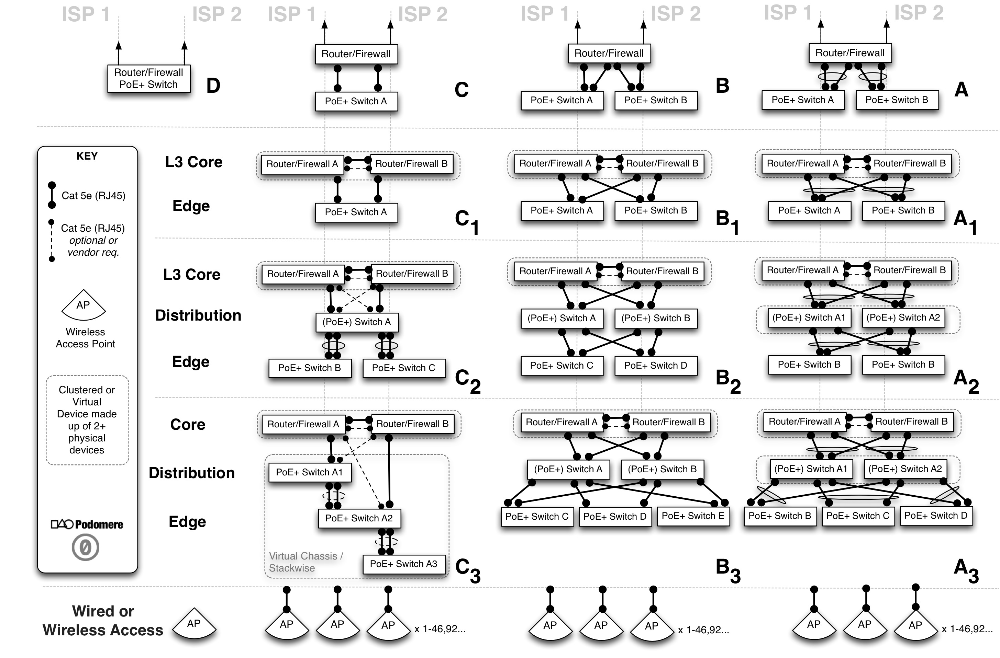

---


# Small to Medium Network Pod

## Introduction
This is a lean design document to help small organisations quickly design and build an intelligent and scalable network access pod. The design focuses on known good patterns and seeks to facilitate decision making in relation to design choices, purchasing, and a range of implementation considerations. This design document is a mix of many traditional discrete documents. You may notice business requirements, technical requirements, solution architecture, high level design, low level design, and 'as built' elements to name a few, however this is entirely intentional as we seek to provide practical, useful, and concise information. Rather than generate [ITIL](http://www.itil-officialsite.com/AboutITIL/WhatisITIL.aspx) shelfware or [OpenGroup TOGAF](http://www.opengroup.org/togaf/) aligned frameworks we decided to pare things back to provide open and relevant recipes for organisations to make decisions and get things done. 

The overall goal is to catalyse community sharing and accelerated access to free and open network buidling knowlegde while also empowering groups to contribute back to the movement. Reliable network platforms help communities achieve the best quality access and experience for their resources. Networks also require ongoing operational management, instrumentation, and continued optimisation to ensure systems are tailored to the environment and able to meet the changing demands placed upon them. This 'cheat sheet' aims to accelerate design decisions and implementation by cutting out the 'fat' normally found in proprietary system integrator designs whilst exposing some of the tacit knowledge that lead to said designs in the first place. The intent is to share these patterns and recipes far and wide via the FLOSS (Free/Libre/Open Source Software) ethos and tools by initially capturing patterns that our authors have found beneficial in multiple environments and making them available to be easily evolved and forked for the common good. As network platforms underpin all digital connectivity (and also accepting that risk is a factor of dependence), one must then conclude that networks pose the greatest risk to many organisations that rely upon digital fabrics or services to operate. We believe that any such organisational shared network infrastructure (when considering the productivity put at risk) should command a greater operational focus and more effective I.T. spend. If we can help reduce time, waste, and indecision while educating and freeing up resources which help organisations to better manage their network platforms, then we will have succeeded in some of our goals.

## High Level Lean Requirements

| ID |  Description | Rationale |
| ----- |:-------------|:-----|
| R001 | 40-1000 Devices | In 2014 we see about 1 to 4 IP addresses/devices per user (but on average about 1.5 or 2 IPs) thus we are building for organisations with a minimum of 10 users and a maximum of 1000 thus we could see up to 2500 devices in a medium sized network. This 2500 shall be our notional upper bound for this design though it in no way precludes the configuration being used for smaller environments. |
| R002 | Dual redundant ISP links/connectivity | No ISP has 100% uptime thus dual ISP links helps to increase network uptime/reachability. Active/active is the preferred configuration to maximise return on investment. |
| R003 | The user access edge shall scale organically and easily. | To add more users and capacity it should be a case of either plugging in more wireless access points, more switches, or just ordering faster ISP links. So called 'fork-lift' upgrades of core equipment should not be necessary within any 3 to 5 year cycle. |
| R004 | No individual shall be able to monopolise the bandwidth.| A fair share policy must be in place such that one 'hungry' or unwitting user can not adversely impact other users productivity|
| R005 | 99.99% uptime/availability | The goal is an integral service 24/7 but with 4x 9's availability there is 52.56 minutes downtime allowed per year (excluding planned maintenance and even then maintenance should minimise any and all service impact). The aim is to get MTBF-> ∞,and MTTR->0 whilst also ensuring that data and services are always assured and not corrupted.|
| R006 | All devices and paths shall be used efficiently. | Effective load balancing and active-active paths should be used where and when possible. Capacity management and reporting should be automated and easily scheduled. Basic instrumentation should be understood and available to non-technical users/entities.|
| R007 | PoE+(Power over Ethernet) shall be provided.| All edge switching will provide/support PoE for devices and specifically PoE+ for 802.11ac access points. Additionally this has the benefit of powering all security cameras and WiFi once a pod is supplied with power from a UPS(Uninterruptible Power Supply) such that conditioned power and resilience to power outages protects an organisations investment while ensuring maximal uptime for said devices.|
| R008 | Power will be conditioned and provided by a UPS | This extends the lifetime of the equipment, ensures maximal uptime even during brief 'brown outs', and also allows an organisation to help quantify its IT power spend (as all devices run on the UPS as per R008 above.|
| R009 | - | -|
| R010 | - | -|
 
## Design Overview
The following patterns constitute a high level view of some common network pods. Depending upon the budget, desired functionality (and vendor choice or availability), these patterns seek to provide a starting point to help facilitate discussion and the subsequent making of decisions with regards to the level of redundancy and fault tolerance required by the organisation. Small organisations with ```20-150``` users with a high tolerance for potential downtime (outages in network services) could happily use patterns **A**, **B**, **C** or **D** (including dual access points), however small to medium sized organisations with a low tolerance for downtime (not more than a few minutes per year) would do well to begin with patterns **C₁** or **D₁**.



## Service Levels, Engineering, and Maths
There is no escaping basic engineering and many network designs for smaller organisations tend to conveniently side step mathematics yet there are some unavoidable variables and formulas that all organisations should be aware of and factor in to their design if possible. The three values we shall be highlighting are ```MTBF```, ```MTTR```, and ```Availability```:
 
* ```MTBF``` (Mean Time Between Failure) for a component or device, this is the predicted elapsed time between inherent failures of a system during operation. Many vendors of consumer level goods do not calculate nor test for this value yet once you purchase a better grade of equipment, the manufacturers should be able to provide the value e.g. a **Juniper SRX 220's** ```MTBF``` is ```13.46 years``` and a **Juniper SRX220H-POE's** ```MTBF``` is ```11.06 years```.
* ```MTTR``` (Mean Time To Repair) is a basic measure of the maintainability of repairable items. How long would it take to get a fully functioning replacement installed or repair completed such that the whole system is again performing as it was before the failure. Some refer to a Mean Time To Recovery however it is in this context and spirit that we speak of 'repair' i.e. from the moment the device or system is impaired in some way to the moment it is fully functional and in production once more as it was previously. 
* ```Availability``` where we are talking about a system being available in terms of time. Some may argue that 'available' does not equal accessible and they may be right, but we are going to figure out the base level ```Aailability``` of our system so we know what SLA(Service Level Agreement) we can offer to our users or match those from our ISP or other service providers.

``` tex
Availability = MTBF / MTBF + MTTR
```
 
Once we can calculate the ```Availability``` for a device we can then increase that ```Availability``` of the overall pod design by introducing additional redundant paths and devices which ensure our network reachability to our application or remote online services. It has to be said though that one thing we can't ever really account for is human operator error, change management, or undiscovered software bugs - so for the moment we shall ignore them in terms of their potential affect on our pod ```Availability``` and focus on the actual known hardware provided statistics.
 
An example calculation for a device we shall call ```X``` with ```MTBF 13.46 years (117,910 hours)``` and ```MTTR 1 day``` (24 hours i.e. next day on site replacement with a local backup of the configuration ready) might be:
 
```Availability = 117,910 / 117.910 + 24 = 0.999796 = 99.98% ```

An ```Availability``` of ```99.98%``` corresponds to ```1h 45m 11.4s``` of potential downtime per year which isn't bad however if we had 2 devices in parallel we would then get the parallel availability for such a 'cluster' of identical devices where ```Availability``` is now measured by ```Availability = 1-(1-Aₓ)²```
 
So with 2 devices of type ```Aₓ``` in a cluster we get:
 
 ```Availability = 0.999999958384 = 99.999999%``` (which is actually 7 nines and corresponds to 3.15 seconds of potential downtime per year which exceeds the holy grail of 5 nines (99.999%) !)
 
So the lesson here is that components and devices will and do fail, and when they do, it is good engineering practice (if you have the budget and expertise) to have 2 devices with 2 paths rather than just 1 path and 1 device performing a role. We can repeat this exercise for each tier of the network (where there are calculations for devices in serial  ```Availability = Aₓ(A𝑦)``` rather than in parallel ```Availability=1-(1-Aₓ)²)``` however this is beyond the scope of this 'cheat sheet' and suffice it to say that your organisation will be in a better place with what we call ```N+1``` devices (such that we add an extra ```__N__``` to get 1+1=2) rather than just a single device at each layer. Hopefully this small piece of maths will cause you to look more critically at the previous pod layout diagrams once more.
 
### Network Segmentation

There are many reasons to segment networks in terms of failure domains, security, manageability, policy enforcement, visibility, troubleshooting etc. and it's beyond the scope of this document to do a deep dive on all these concepts. For the moment the idea to hold is that of mobility for users, security for different types of devices (and users), and keeping important assets protected from the lower layers upwards. 
 
### Simple Security Model

We advocate a simple model of trusted, untrusted, and semi-trusted examples of which might be that users and guests are semi-trusted, security devices are trusted, and the Internet is untrusted. There are also concepts of control and management in the sense that devices, software, or employess might be deemed controlled or uncontrolled, managed or unmanaged. This classification system means that when we think about an uncontrolled application/user on an unmanaged device coming from an untrusted network, we don't really want them able to directly access our controlled and managed trusted security devices directly in our trusted zone. This is one reason we create partitions so that we can apply policies to traffic when it is moving from one zone of trust to another.

When quickly trying to identifying the risk classification of an asset, computer, device, or person, the below grid may help to quickly figure out where they should reside.
 
| Application or Agent / Device or Person | Untrusted | Trusted | Semi-Trusted |
| ------------- |-------------| -----| -----|
| Uncontrolled / Unmanaged |  X | - | - |
| Uncontrolled / Managed | - | - | X |
| Controlled / Unmanaged |  - | - | X |
| Controlled / Managed |  - | X | - |

## Design Recommendations

### Numbering

It is highly desirable to always when possible connect low numbers to low numbers, and ascending connections together towards higher numbers connecting to higher numbers. This means that for example when you connect a port from one switch to another switch you should always try and connect port 1 on switch A to port 1 on switch B (if possible). When connecting switch ports to patch panels it's also considered good practice to connect the lowest ports on the switch in sequence to the lowest numbered ports on a patch panel (even match them if you can!) and the same thing for higher ports to higher ports.

#### Example Cable Matrices

If cabling is not going directly from device A to device B then it may well go through some fixed or structured cabling to get to a remote device endpoint.

##### Cable Matrix 1

| Device A Port ID | A Presentation | Cable Type | Patch X ID | Patch Y ID | Cable Type | B Presentation | Device B Port ID |
| ------------- |-------------| -----| -----| --- | ---- | ---- | ----- |
| hostA g1 | RJ45 | Cat5e | A1.1 | R1.7 | Cat5e | RJ45 | hostB g1 |
| hostA g2 | RJ45 | Cat5e | A1.2 | R1.8 | Cat5e | RJ45 | hostB g2 |
| hostA g3 | RJ45 | Cat5e | B1.1 | S2.7 | Cat5e | RJ45 | hostB g3 |
| hostA g4 | RJ45 | Cat5e | B1.2 | S2.8 | Cat5e | RJ45 | hostB g4 |
| hostA g5 | RJ45 | Cat5e | C1.1 | T1.1 | Cat5e | RJ45 | hostB g5 |
| hostA g6 | RJ45 | Cat5e | C1.2 | T1.2 | Cat5e | RJ45 | hostB g6 |

##### Cable Matrix 2

| Device A Port ID | A Presentation | Cable Type | Patch X ID | Patch Y ID | Cable Type | B Presentation | Device B Port ID |
| ------------- |-------------| -----| -----| --- | ---- |---- | ----- |
| switchA |   |   |   |   |   |   | switchB |
| g1 | SFP+ | MMF(OM3) | A1.1 | R1.7 | MMF(OM3) | SFP+ | g1 |
| g2 | SFP+ | MMF(OM3) | A1.2 | R1.8 | MMF(OM3) | SFP+ | g2 |
| g3 | RJ45 | Cat6a | B1.1 | S2.7 | Cat6a | RJ45 | g3 |
| g4 | RJ45 | Cat6a | B1.2 | S2.8 | Cat6a | RJ45 | g4 |
| g5 | SFP+ | SM | C3.1 | R5.1 | SM | SFP+ | g5 |
| g6 | SFP+ | SM | C3.2 | R5.2 | SM | SFP+ | g6 |

**Note I:** MMF=Multimode (fibre), SM=Single Mode (fibre)

**Note II:** Where the patch can be a ToR(Top of Rack) copper or fibre patch panel. Sometimes you will hear the terms IDF(Intermediate Distribution Frame) or MDF(Main Distribution Frame) in relation to the infrastructure cabling. If you are using fibre you may hear the terms ODF(Optical Distribution Frame) or FOBOT(Fibre Optic Break Out Tray).

### Naming

When naming any assets it is desirable to be consistent and have the concept of a namespace from which to build hierarchies and relationshoips between components, services, and agents.

#### Physical Assets

It is highly recommended to encode some idea of the device function and location in to its name (however this is not actually necessary and some may argue that this is what SNMP(Simple Network Management Protocol) system and location details are for). Doing this has however proven very useful in distinguishing devices, automating, and performing management tasks. Following a naming convention (including that of adding the device in to the DNS namespace (and/or an organisation's asset management tool) helps to identify, manage, and enumerate things more clearly! (More: [http://tools.ietf.org/html/rfc1034#section-3.1](http://tools.ietf.org/html/rfc1034#section-3.1)).
 
Every name should be configured and written in lower case and one should always avoid lower case 'L's and upper case 'i's. Dashes should be used to separate names in to easily recognised variables, and dots should separate zones, groups, and tiers which are then compatible with DNS.

#### Example Schema

```cc-city-org-funcLvID.dep.domain.tld``` 
 
So an example for the first firewall on level 2 of a building in Berlin, Germany for the I.T. department in the organisation 'Mitose' would be: 
```
de-ber-mit-fw02a.it.mitose.com
``` 

There are many approaches to this so the above is just to be considered a helpful hint and only one way of many to organise ones namespace. Equally one could create multiple sub classifications however it can become unruly to manage if there are too many child sub-domains or zones. 

#### Virtual Assets

Most of the same guidelines apply to naming and placing virtual assets in the namespace however you may want to encode interfaces or services also. It would be worth reviewing how DNS SRV(Service) resource records are encoded as it's always recommended to create records in DNS: [http://en.wikipedia.org/wiki/SRV_record](http://en.wikipedia.org/wiki/SRV_record)
 
### IP Address Design
IP Address design is one of the fundamental building blocks which can even influence the physical connectivity based upon the security requirements. Good IP address design and management is foundational and can make things much easier down the road when applying organisational or technical policies to application traffic flows, tenancies, users or subsets of devices. A simple IP address model for the aforementioned network pods is based upon /21 subnets and allows for user, guest, voice, security, and management blocks including additional sub-divisions for things like sub-tenancies and unexpected uses. A good rule is to always add on about 50% to the number of  IP addresses or subnets you think you need now to save yourself later.
 
We recommend using the lowest IP address of each subnet as the default gateway e.g. 10.0.64.1 in 10.0.64.0/22 and 10.0.74.129 in 10.0.74.128/26. We also recommend keeping the first 50 IP's in larger subnets (and the first 10 in smaller ones) for assigning static IPs from and also for certain infrastructure purposes, including but not limited to, HSRP, VRRP, GBLP, VRF's etc. If each pod constitutes a physical site such as a building or small campus then (depending upon the number of devices/users per floor), the design tends towards a main /22 user subnet at the beginning of the block. The following is an example of the fifth such site with other pods using 10.0.0.0/20, 10.0.16/20, 10.0.32/20, 10.0.48/20 and then the 5th site is 10.0.64/20.

#### Example Site IP Schema

| Subnetting for RC1918 Address Space | Description of Use |
| --------------------------- |:-----------------------|
|10.0.64/20| Organisation / Coworking Site 16 x /24's overall|
|\- **10.0.64.0/21** | **Users and Guests Devices** |
|\-\- **10.0.64.0/22** | **1-971 User Devices in Data Network / use DHCP above .50** |
|\-\- **10.0.68.0/22** | **Guest and Voice (special treatment)**|
|\-\-\- 10.0.68.0/23 | 459 Guests Data Network / use DHCP above .50|
|\-\-\- 10.0.70.0/23 | Voice and Fixed Video Conferencing Devices |
|\-\-\-\- 10.0.70/24 | Voice Handsets (VoIP can also be in < .50 Member Data Static Reservations |
|\-\-\-\- 10.0.71/24 | Video Conferencing Devices |
|\- **10.0.72.0/21** |**Dedicated Tenant Team Rooms or Servers** |
|\-\- **10.0.72/22** | **Up to 8 Team Rooms or 4 Server Networks**|
|\-\-\- 10.0.72/23 | Team Rooms/Servers|
|\-\-\-\- 10.0.72/24 | Team Rooms (Servers would use whole /24) |
|\-\-\-\-\- 10.0.72/25 | **Team A** |
|\-\-\-\-\-\- 10.0.72.0/26 | Appliances/Users |
|\-\-\-\-\-\- 10.0.72.64/26 | VoIP Phones  |
|\-\-\-\-\- 10.0.72.128/25 | **Team B** |
|\-\-\-\-\-\- 10.0.72.128/26 | Appliances/Users |
|\-\-\-\-\-\- 10.0.72.192/26 | VoIP Phones  |
|\-\-\-\- 10.0.73/24 | Team Rooms (Servers would use whole /24) |
|\-\-\-\-\- 10.0.73/25 | **Team C** |
|\-\-\-\-\-\- 10.0.73.0/26 | Appliances/Users |
|\-\-\-\-\-\- 10.0.73.64/26 | VoIP Phones  |
|\-\-\-\-\- 10.0.73.128/25 | ** Team D** |
|\-\-\-\-\- 10.0.73.128/25 | **Team D** |
|\-\-\-\-\-\- 10.0.73.128/26 | Appliances/Users |
|\-\-\-\-\-\- 10.0.73.192/26 | VoIP Phones  |
|\-\-\- 10.0.74/23 | Team Rooms/Servers|
|\-\-\-\- 10.0.74/24 | Team Rooms (Servers would use whole /24) |
|\-\-\-\-\- 10.0.74/25 | **Team E** |
|\-\-\-\-\- 10.0.74/25 | **Team E** |
|\-\-\-\-\-\- 10.0.74.0/26 | Appliances/Users |
|\-\-\-\-\-\- 10.0.74.64/26 | VoIP Phones  |
|\-\-\-\-\- 10.0.74.128/25 | **Team F** |
|\-\-\-\-\-\- 10.0.74.128/26 | Appliances/Users |
|\-\-\-\-\-\- 10.0.74.192/26 | VoIP Phones  |
|\-\-\-\- 10.0.75/24 | Team Rooms (Servers would use whole /24) |
|\-\-\-\-\- 10.0.75/25 | **Team G** |
|\-\-\-\-\-\- 10.0.75.0/26 | Appliances/Users |
|\-\-\-\-\-\- 10.0.75.64/26 | VoIP Phones  |
|\-\-\-\-\- 10.0.75.128/25 | **Team H** |
|\-\-\-\-\-\- 10.0.75.128/26 | Appliances/Users |
|\-\-\-\-\-\- 10.0.75.192/26 | VoIP Phones  |
|\-\-\-\-\- 10.0.74/25 | **Team E** |
|\-\-\-\-\-\- 10.0.74.0/26 | Appliances/Users |
|\-\-\-\-\-\- 10.0.74.64/26 | VoIP Phones  |
|\-\-\-\-\- 10.0.74.128/25 | **Team F** |
|\-\-\-\-\-\- 10.0.74.128/26 | Appliances/Users |
|\-\-\-\-\-\- 10.0.74.192/26 | VoIP Phones  |
|\-\-\-\- 10.0.75/24 | Team Rooms (Servers would use whole /24) |
|\-\-\-\-\- 10.0.75/25 | **Team G** |
|\-\-\-\-\-\- 10.0.75.0/26 | Appliances/Users |
|\-\-\-\-\-\- 10.0.75.64/26 | VoIP Phones  |
|\-\-\-\-\- 10.0.75.128/25 | **Team H** |
|\-\-\-\-\-\- 10.0.75.128/26 | Appliances/Users |
|\-\-\-\-\-\- 10.0.75.192/26 | VoIP Phones  |
|\-\- **10.0.76/22** | **Management and Infrastructure Purposes** |
|\-\-\- 10.0.76/23 | Infrastructure Device Management / In-band OOB |
|\-\-\-\- 10.0.76/24 | Infrastructure Device Management (Switches, Firewalls, Access Points) |
|\-\-\-\- 10.0.77/24 | OOB(Out of Band) Device Access |
|\-\-\- 10.0.78/23 | Security Devices|
|\-\-\-\- 10.0.78/24 | Security Cameras and Sensors |
|\-\-\-\- 10.0.79/24 | __<Reserved>__ |

### VLANS
VLANs are **Virtual** Local Area Networks used to partition and minimise layer 2 broadcast domains. They can also provide some extra separation at layer 2 from a security context (though not infallible). Many people still get confused between VLANs and subnets however they should not be confused and are not simply interchangeable.
 
It is though always nice to have VLAN IDs match the third octet of your subnet (however this is not always possible). Even with extended VLAN ranges you may not be able to initially match your VLAN IDs to subnets nor may not even care (as VLANs are their own identifiers and not bound in any way to the layer 3 subnets). However for small customer networks (i.e. not large enterprise, ISP, or data center networks) it can be easy to match VLANs to subnets if you're not worried about wasting or breaking VLAN ranges. We present such a schema below that matches the above subnet ranges. Please check with your vendor documentation which VLANs are configurable or reserved for special purposes.
 
#### Example Site VLAN Schema
Depending upon how many sites you have, your desire for unique IDs, and any future plans to bridge layer 2 domains (which we recommend against) you may find the below schema usable and easily repeatable for up to 6 sites (though it is quite wasteful of the higher VLAN ranges there are still thousands to cherry pick from and as this is not a Secure Multi-Tenant IaaS or cloud design we can afford to focus on aesthetics and not pure scalability!).
 
**Note:** Please remember that as long as you are not layer 2 bridging sites and pods you can happily re-use VLAN IDs in each site, thus there is no issue with having VLAN 20 or VLAN 64 in two separate sites.

| VLAN ID | Subnet Range | Description |
|---- | ---------------- |:---------------------|
| 64 | 10.0.64.0/22 | User Devices |
| 68 | 10.0.68.0/23 | Guest Devices |
| 70 | 10.0.70/24 | User Voice Devices |
| 71 | 10.0.71/24 | User Video Conferencing |
| 72 | 10.0.72/24 | Server Network 1 (if Team A+B not used) |
| 572 | 10.0.72.0/26 | Team A  Appliances/Users |
| 1572 | 10.0.72.64/26 | Team A VoIP Phones | 
| 2572 | 10.0.72.128/26 | Team B  Appliances/Users |
| 3572 | 10.0.72.196/26 | Team B VoIP Phones | 
| 73 | 10.0.73/24 | Server Network 2 (if Team C+D not used) |
| 573 | 10.0.73.0/26 | Team C  Appliances/Users |
| 1573 | 10.0.73.64/26 | Team C VoIP Phones | 
| 2573 | 10.0.73.128/26 | Team D  Appliances/Users |
| 3573 | 10.0.73.196/26 | Team D VoIP Phones | 
| 74 | 10.0.74/24 | Server Network 3 (if Team E+F not used) |
| 574 | 10.0.74.0/26 | Team E  Appliances/Users |
| 1574 | 10.0.74.64/26 | Team E VoIP Phones | 
| 2574 | 10.0.74.128/26 | Team F  Appliances/Users |
| 3574 | 10.0.74.196/26 | Team F VoIP Phones | 
| 75 | 10.0.75/24 | Server Network 4 (if Team G+H not used) |
| 575 | 10.0.75.0/26 | Team G  Appliances/Users |
| 1575 | 10.0.75.64/26 | Team G VoIP Phones | 
| 2575 | 10.0.75.128/26 | Team H  Appliances/Users |
| 3575 | 10.0.75.196/26 | Team H VoIP Phones | 
| 76 | 10.0.76/24 | Infrastructure Device Management | 
| 77 | 10.0.77/24 | OOB(Out of Band) Device Access|
| 78 | 10.0.78/24 | Security Cameras and Sensors |
| 79 | 10.0.79/24 | Reserved for future use |

### Feeds, Speeds, and Ratios

#### ISP(Internet Service Providers)
For any dual ISP configuration it is desirable to have totally separate ISP providers (and if possible also, totally diverse paths to network equipment including that of the building POP(Point of Presence) and risers - however this is rarely feasible in terms of both physical architecture and cost). Apart from the fact that using the same ISP for both links would represent the same administrative, governance, and reachbility failure domain; it does not facilitate competitive pricing leverage and constitutes a form of serious vendor lock in. One may use the same ISP as one of the main links for multiple sites which can reduce the number of hops and decrease latency for any inter-site replication of data.

Depending upon your country or territory ISP links and plans can vary widely in terms of costs and features yet what is optimal is a **fibre link** with **unlimited Internet** (and 'on-net' data), and a basic QoS(Quality of Service) offering such that you can colour traffic and have it handled differently by the ISP. Unlimited data allowances greatly reduce the need for extremely difficult and expensive elements of capacity management normally experienced by those who sign up to ISP plans with data caps (normally in the hope of saving costs which backfires). Additionally fibre is not subject to the same weaknesses and interference that copper services are, and has a much better upgrade path whereby the ISP in most cases can just dial up the service rate with a few simple remote commands.

Symmetric services are also preferred over asymmetric services as contention for uploads is one of the greatest threats in terms of network access quality. Asymmetric services also make configuration for QoS more difficult, costly, and less simple. The future seems set to see content generation and upload demands increase so ensure that symmetric services are provisioned.

Contention is an oft unspoken variable in ISP services and can bring a service to its knees so ensure that a 1:1 contented Internet service is chosen such that your organisation is not at the behest of the traffic patterns of the other ISPs clients.

#### Example Speeds and Ratios

The following figures are rough guides and depend wholly on the type and style of usage in the space however we have found that the most conservative requirements for users are ```3 / 3 Mbps``` each (which still enables SD/HD video streaming and ```1:1``` HD video conferencing) combined with an infrastructure ratio of ```6:1``` sharing of the maximum achievable single Internet flow (i.e. 20 Mbps for a true 20 Mbps link etc.) works well when fairly shaping devices or endpoints. Unfortunately the nature of your actual traffic streams can only really be inferred over time by using application visibility or DPI(Deep Packet Inspection)to determine what is deemed to be critical valid traffic and what is superfluous or invalid traffic. The nature of most endpoints whether wired or wireless is that they can and sometimes do generate excessive amounts of connections or throughput that may overwhelm the local ISP link if left unchecked. The ugly truth is that irrespective of queuing methodologies, a saturated buffer is a saturated buffer, and a full pipe is a full pipe.

It may not be a popular position but shaping the endpoints to ensure that a fixed number of concurrent users operating at their maximum allowable speed can not overwhelm an Internet link is just good defensive practice. Of course one can give certain endpoints priority or guaranteed throughput above all others however the more complex the policies enforced, the harder they are to maintain and troubleshoot.

The below is a non-complete/non-exhaustive guide to give an indication of how to sustainably manage the Internet access speeds.

| Number of Users | ISP Service Type | Recommended shaping per endpoint | 
|---- |:---------------- |:---------------------|
| 20-50 | EFM (10/10 Mbps) | 2.5 / 2.5 Mbps |
| 20-50 | EFM (20/20 Mbps) | 3 / 3 Mbps |
| 20-100 | EFM (20/20 Mbps) | 3 / 3 Mbps |
| 20-100 | VDSL2 (20/20 Mbps) | 3 / 3 Mbps |
| 50-200 | EFM (45/45 Mbps) | 7 / 7 Mbps |
| 50-200 | VDSL2 (50/50 Mbps) | 9 / 9 Mbps |
| 50-500 | EPON / GPON / WDM / SDH (100/100 Mbps) | 15 / 15 Mbps | 
| 500-1000 | EPON / GPON / WDM / SDH (300/300 Mbps) | 50 / 50 Mbps | 

#### Infrastructure Cabling and Speeds

All infrastructure and access cabling should be gigabit and any trunks (where possible) should form 2 Gbps LAG(Link Aggregation). 

**Note:** At the time of writing 1 Gbps is still sufficient even to 802.11ac wireless access points however if the opportunity arise to run dual cabling to access points it should be taken as much for redundancy as for future proofing the throughput.


### Port Layouts

Diagrams of ports on switch and mention ASIC separation.

### Port Budgets

Maths for access points and other devices or wired users.

### Wired Load Balancing

### Traffic Engineering

### QoS(Quality of Service) and Rate-Limiting

### Power and UPS

### Wireless Microcells


## Management, Instrumentation, and Telemetry

## Example BOM(Bill of Materials) and Budget

### Example High Availability BOM(Bill of Materials) and Budget

### Capital Expenditure and Operational Expenditure

### Attribution
