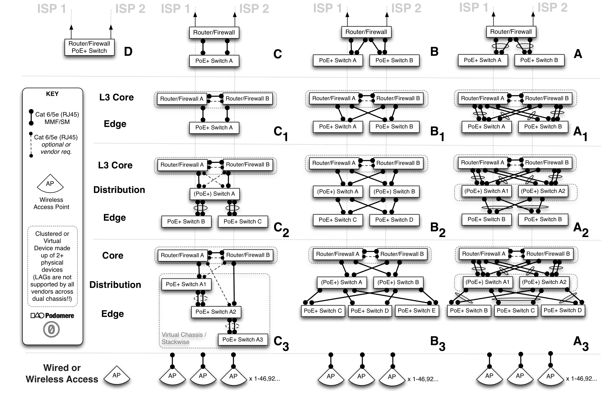

---


# Small to Medium Access Pod

This pod consists of both a wired and wireless network platform supporting dual ISP links. It can scale both its ISP links and access edges easily and without forklift upgrades. The focus is on fair-share and user experience as it relates to a BYOD(Bring Your Own Device) coworking environment. The components should provide the ability to calculate an in-path service uptime SLA(Service Level Agreement) where and when possible. All edge ports shall support PoE+ 802.3at (as opposed to basic PoE 802.3af) for full 802.11ac support and device future-proofing. 

**Note:** All ```48``` gigabit ports of the _listed_ switch supply PoE+ and there are an additional ```4``` ports which are SFP/SFP+ (which support ```1 Gbps``` or ```10 Gbps``` for a range of further options). All access edge devices are cloud managed for simplicity, reduced controller footprint, and ease of lifecycle management.

## High Level Lean Requirements

| ID |  Description | Rationale |
| ----- |:-------------|:-----|
| R001 | ```40-500``` users | In 2014 we see about ```1``` to ```4``` IP addresses/devices per user (but on average about ```1``` to ```2``` IPs) thus we are building for organisations with a minimum of ```40``` user devices and a maximum of ```2000``` . Depending upon the core layer 3 device a pod can easily scale the number of edge access points but one must take in to account the concurrent connection limit and capabilities. An initial ```300``` shall be our notional upper bound for this design (based upon ```3``` access points only) though it in no way precludes the configuration being used for either smaller or larger environments. |
| R002 | Support for dual redundant ISP links/connectivity | No ISP has ```100%``` uptime thus dual ISP links help to increase network uptime/reachability. Active/active is the preferred configuration for ISP links to maximise return on investment. Caluculations should be performed to understand the potential impact of any single point of failure in a network design. |
| R003 | The user access edge shall scale organically and easily. | To add more users and capacity it should be a case of either plugging in more wireless access points, more switches, or just ordering faster ISP links. So called 'fork-lift' upgrades of core equipment should not be necessary within any ```3``` to ```5``` year cycle once the core is right-sized from the outset. |
| R004 | No individual shall be able to monopolise the bandwidth.| A fair share policy must be in place such that one 'hungry' or unwitting user or device can not adversely impact other users productivity and access. This is the fair-share policy enforcement capability.|
| R005 | ```99.99%``` uptime/availability | The goal is an integral service ```24/7``` but with ```4x 9's``` availability there is ```52.56 minutes``` downtime allowed per year (excluding planned maintenance and even then maintenance should minimise any and all service impact). The aim is to get to a ```MTBF-> ∞``` and a ```MTTR->0``` whilst also ensuring that data and services are always integral and assured.|
| R006 | All devices and paths shall be used efficiently. | Effective load balancing and active-active paths should be used where and when possible including across n+1 tiers if applicable. Capacity management and reporting should be automated and easily scheduled. Basic instrumentation and dashboards should be easily understood and available to non-technical users/entities.|
| R007 | PoE+(Power over Ethernet) 802.3at shall be provided.| All edge switching will provide/support PoE+(plus) for devices (i.e. 802.3at and not just 802.3af) specifically for 802.11ac access points and device futureproofing. Additionally this has the benefit of powering all devices and WiFi access points if a pod is supplied with clean/protected power from a UPS(Uninterruptible Power Supply). Furthermore conditioned power and resilience to power outages protects an organisations investment while ensuring maximal uptime for said devices and services.|
| R008 | Power will be conditioned and provided by a UPS | This not only extends the lifetime of the equipment investment but ensures maximal uptime even during brief 'brown outs' or over-voltage conditions. A remotely instrumented UPS also allows an organisation to help quantify its I.T. power spend and refine its operating expenditure (as all devices run on the UPS as per ```R007``` above.|
| R009 | Dual gigabit PoE+ to access points | All 802.11ac access points shall have dual gigabit cabling run to them. This is to support full throughput in the form of ```2``` gigabit aggregated links for future 160GHz channel bonding of 802.11ac and also to allow maximum data transfer locally between high throughput 802.11ac clients. Additionally this provides data path *and* power redundancy to access points in the case of a path failure or interface failure.|
| R010 | Ability to shape wired users by group and individual policies| Irrespective of queuing strategies there must be the capability to control wired users and ensure they can not displace wireless users or the overall 'fair share' policies. This must be easily implemented on a per SRC IP and per FW policy basis.|
 
## Design Overview

The following patterns constitute a high level view of some common network pods. Depending upon the budget, desired functionality (and vendor choice or availability), these patterns seek to provide a starting point to help facilitate discussion and the subsequent making of decisions with regards to the level of redundancy and fault tolerance required by the organisation. Small organisations with ```20-150+``` users with a higher tolerance for potential downtime (outages in and unavailability of network services) could happily use patterns **D**, **C**, **B** or **A** (including single or dual wireless access points), however small to medium sized organisations with a low tolerance for downtime (not more than a few minutes per year) would do well to begin with patterns **B₁** or **A₁** and a minimum of dual wireless access points.



## Service Levels, Engineering, and Maths
There is no escaping basic engineering and many network designs for smaller organisations tend to conveniently side step mathematics yet there are some unavoidable variables and formulas that all organisations should be aware of and factor in to their design if possible. The three values we shall be highlighting are ```MTBF```, ```MTTR```, and ```Availability```:
 
* ```MTBF``` (Mean Time Between Failure) for a component or device, this is the predicted elapsed time between inherent failures of a system during operation. Many vendors of consumer level goods do not calculate nor test for this value yet once you purchase a certain grade of equipment the manufacturers should be able to provide this value e.g. a **Juniper SRX 220's** ```MTBF``` is ```13.46 years``` and a **Juniper SRX220H-POE's** ```MTBF``` is ```11.06 years```.
* ```MTTR``` (Mean Time To Repair) is a basic measure of the maintainability of repairable items. How long would it take to get a fully functioning replacement installed or repair completed such that the whole system is again performing as it was before the failure. Some refer to a Mean Time To Recovery however it is in this context and spirit that we speak of 'repair' i.e. from the moment the device or system impaired in some way to the moment it is fully functional and in production once more (as it was previously). 
* ```Availability``` where we are talking about a system being available in terms of time. Some may argue that 'available' does not equal accessible and they may be right, but we advocate calculating the base level ```Availability``` of hardware in any system so one knows what SLA(Service Level Agreement) can actually be offered to users (or how to align an equipment spend to better or match another service providers SLA's).

```
Availability = MTBF / MTBF + MTTR
```
 
Once one calculates the ```Availability``` for a device one can then increase that ```Availability``` of the overall pod design by introducing additional redundant paths and devices which ensures network reachability to an application or remote online service. It has to be said though that one thing that can't ever really be accounted for is human operator error, change management, or undiscovered software bugs - so for the moment we shall ignore them in terms of their potential affect on a pod's ```Availability``` and focus on the actual known hardware provided metrics.
 
An example calculation for a device we shall call ```X``` with ```MTBF 13.46 years (117,910 hours)``` and ```MTTR 1 day``` (24 hours i.e. next day on site replacement with a local backup of the configuration ready) might be:
 
```Availability = 117,910 / 117.910 + 24 = 0.999796 = 99.98% ```

An ```Availability``` of ```99.98%``` corresponds to ```1h 45m 11s``` of potential downtime per year which isn't bad yet if we had 2 devices in parallel we would then get the parallel availability for such a 'cluster' of identical devices where ```Availability``` is now measured by ```Availability = 1-(1-Aₓ)²```
 
So with 2 devices of type ```Aₓ``` in a cluster we get: ```Availability = 0.999999958384 = 99.999999%``` (which is actually 7 nines and corresponds to 3.15 seconds of potential downtime per year which exceeds the holy grail of 5 nines (99.999%) !)
 
So the lesson here is that components and devices will and do fail, and when they do, it is good engineering practice (if you have the budget and expertise) to have at least ```2``` devices with dusl redundant paths rather than just a single path and ```1``` device performing a certain role. We can repeat this exercise for each tier of the network (where there are calculations also for devices in serial  ```Availability = Aₓ(A𝑦)``` rather than in parallel ```Availability=1-(1-Aₓ)²)``` however this is beyond the scope of this 'cheat sheet' and suffice it to say that your organisation will be in a better place with what we call ```N+1``` devices at each tier (i.e. an addition of an extra ```n``` devices to get a minimum of ```1+1=2```) rather than just a single device at each layer. Hopefully this small piece of maths will cause you to look more critically at the previous pod layout diagrams once more.
 
**Note:** The design pattern of the Pod **C** allows for only a single serial pathway to Internet services and Fortinet do not readily publish their ```MTBF``` values.
 
### Network Segmentation

There are many reasons to segment networks in terms of failure domains, security, manageability, policy enforcement, visibility, troubleshooting, to name a few (and it's beyond the scope of this document to do a deep dive on these concepts) but for the moment the important concepts are that of:

* mobility for users (intra-zone)
* security for different types of devices and users (inter-zone)
* and keeping important assets protected from their lower layers upwards (and adjacent zones) 
 
### Simple Security Model

We advocate a simple security model of trusted, untrusted, and semi-trusted zoning. Examples of which might be that users and guests are semi-trusted, security devices and agents are trusted, and the Internet is deemed untrusted. There are also concepts of control and manageability in the sense that devices, software, or employees might be deemed controlled or uncontrolled, and managed or unmanaged. This classification system means that when one thinks about an uncontrolled application/user on an unmanaged device coming from an untrusted zone, one doesn't really want them able to directly reach controlled and managed security devices (which reside in the trusted zone). This is one reason partitions are created so that policies can be applied to traffic at network boundaries when it is moving from one zone of trust to another.

When quickly trying to identifying the risk classification of an asset, computer, device, or person; the below grid may help to quickly figure out where they should reside.
 
| Application or Agent / Device or Person | Untrusted | Trusted | Semi-Trusted |
| ------------- |-------------| -----| -----|
| Uncontrolled / Unmanaged |  X | - | - |
| Uncontrolled / Managed | - | - | X |
| Controlled / Unmanaged |  - | - | X |
| Controlled / Managed |  - | X | - |

**Note:** For a more in-depth but still easily understood security framework, we recommend reviewing the [Secure Arc Reference Architecture](http://www.securearc.com/wiki/index.php/The_Secure_Arc_Reference_Architecture).

## Design Recommendations


### Naming

When naming any assets it is desirable to be consistent and have the concept of a namespace from which to build hierarchies and relationshoips between entities i.e. components, services, and agents.

#### Physical Assets

It is highly recommended to encode some idea of the device function and location in to its name (however this is not actually necessary and some may argue that this is what SNMP(Simple Network Management Protocol) system and location details are for). Doing this has however proven very useful in distinguishing devices, automating, and performing management tasks. Following a naming convention (including that of adding the device in to the DNS namespace (and/or an organisation's asset management tool) helps to identify, manage, and enumerate all things more clearly! For larger organisations worries about information leakage and reconaissance, split DNS is recommended. (More on naming: [http://tools.ietf.org/html/rfc1034#section-3.1](http://tools.ietf.org/html/rfc1034#section-3.1)).
 
Every name should be configured and written in lower case and one should always avoid lower case '```L```'s and upper case '```i```'s. Dashes should be used to separate names in to easily recognised variables, and dots should separate zones, groups, and tiers which are then compatible with DNS.


#### Example FQDN Schema

```cc-city-org-funcLvID.dep.domain.tld``` 
 
So an example for the first firewall on level 2 of a building in Berlin, Germany for the I.T. department in the organisation 'Mitose' would be: 
```
de-ber-mit-fw02a.it.mitose.com
``` 

There are many approaches to this so the above is just to be considered a helpful hint and only one way of many to organise ones namespace. Equally one could create multiple sub classifications however it can become unruly to manage if there are too many child sub-domains or zones. 


#### Example Hostnames

This should be configured as the pattern for the hostname on each device.

``` cc-city-org-funcLvID```

| Hostname | Device |
| ----------------| ------------------------|
| de-ber-mit-fw03a | Primary Firewall on Lv3 | 
| de-ber-mit-sw03a | Initial Switch on Lv3 |
| de-ber-mit-ap03a | First  access point on Lv3 |
| de-ber-mit-ap03b | Second access point on Lv3 |
| de-ber-mit-ap03c | Third  access point on Lv3 |

#### Virtual Assets

Most of the same guidelines apply to naming and placing virtual assets in the namespace however you may want to encode interfaces or services also. It would be worth reviewing how DNS SRV(Service) resource records are encoded as it's always recommended to create records in DNS: [http://en.wikipedia.org/wiki/SRV_record](http://en.wikipedia.org/wiki/SRV_record)

### IP Address Design

IP Address design is one of the fundamental building blocks which can even dictate the physical connectivity based upon the security or capacity requirements. Good IP address design and management is foundational and can make things much easier down the road when applying organisational or technical policies to application traffic flows, tenancies, users, or subsets of devices. A simple IP address model for the aforementioned network pods is based upon ```/21``` CIDR subnets and allows for user, guest, voice, security, and management blocks including additional sub-divisions for things like sub-tenancies or other unexpected uses. A good rule is to always add on about ```30-50%``` to the number of IP addresses or subnets you think you need currently -> to save yourself much pain later!
 
We recommend using the lowest IP address of each subnet as the default gateway e.g. ```10.0.64.1``` in ```10.0.64.0/22``` and ```10.0.74.129``` in ```10.0.74.128/26```. We also recommend keeping the first 50 IP's in larger subnets (and the first 10 in smaller ones) for assigning static IPs from and also for certain infrastructure purposes, including but not limited to, HSRP, VRRP, GBLP, VRF's etc. If each pod constitutes a physical site such as a building or small campus then (depending upon the number of devices/users per floor), the design tends towards a main ```/22``` user subnet at the beginning of the block. The following is an example of the third such site with other pods using ```10.0.0.0/20```, ```10.0.16/20```, ```10.0.32/20```, ```10.0.48/20``` and then the 5th site is ```10.0.64/20```.

#### IP Schema

| Subnetting for RFC1918 Address Space | Description of Use |
| --------------------------- |:-----------------------|
|10.0.32/20| Organisation / Coworking Site 16 x /24's overall|
|\- **10.0.32.0/21** | **Users and Guests Devices** |
|\-\- **10.0.32.0/22** | **1-971 User Devices in Data Network / use DHCP above .50** |
|\-\- **10.0.36.0/22** | **Guest and Voice (special treatment)**|
|\-\-\- 10.0.36.0/23 | **1-459 Guests Data Network / use DHCP above .50**|
|\-\-\- 10.0.40.0/23 | Voice and Fixed Video Conferencing Devices |
|\-\-\-\- 10.0.40/24 | Voice Handsets (VoIP can also be in < .50 Member Data Static Reservations |
|\-\-\-\- 10.0.41/24 | Video Conferencing Devices |
|\- **10.0.42.0/21** |**Dedicated Tenant Team Rooms or Servers** |
|\-\- **10.0.42/22** | **Up to 8 Team Rooms or 4 Server Networks**|
|\-\-\- 10.0.42/23 | Team Rooms/Servers|
|\-\-\-\- 10.0.42/24 | Team Rooms (Servers would use whole /24) |
|\-\-\-\-\- 10.0.42/25 | **Team A** |
|\-\-\-\-\-\- 10.0.42.0/26 | Appliances/Users |
|\-\-\-\-\-\- 10.0.42.64/26 | VoIP Phones  |
|\-\-\-\-\- 10.0.42.128/25 | **Team B** |
|\-\-\-\-\-\- 10.0.42.128/26 | Appliances/Users |
|\-\-\-\-\-\- 10.0.42.192/26 | VoIP Phones  |
|\-\-\-\- 10.0.43/24 | Team Rooms (Servers would use whole /24) |
|\-\-\-\-\- 10.0.43/25 | **Team C** |
|\-\-\-\-\-\- 10.0.43.0/26 | Appliances/Users |
|\-\-\-\-\-\- 10.0.43.64/26 | VoIP Phones  |
|\-\-\-\-\- 10.0.43.128/25 | **Team D** |
|\-\-\-\-\-\- 10.0.43.128/26 | Appliances/Users |
|\-\-\-\-\-\- 10.0.43.192/26 | VoIP Phones  |
|\-\-\- 10.0.44/23 | Team Rooms/Servers|
|\-\-\-\- 10.0.44/24 | Team Rooms (Servers would use whole /24) |
|\-\-\-\-\- 10.0.44/25 | **Team E** |
|\-\-\-\-\-\- 10.0.44.0/26 | Appliances/Users |
|\-\-\-\-\-\- 10.0.44.64/26 | VoIP Phones  |
|\-\-\-\-\- 10.0.44.128/25 | **Team F** |
|\-\-\-\-\-\- 10.0.44.128/26 | Appliances/Users |
|\-\-\-\-\-\- 10.0.44.192/26 | VoIP Phones  |
|\-\-\-\- 10.0.45/24 | Team Rooms (Servers would use whole /24) |
|\-\-\-\-\- 10.0.45/25 | **Team G** |
|\-\-\-\-\-\- 10.0.45.0/26 | Appliances/Users |
|\-\-\-\-\-\- 10.0.45.64/26 | VoIP Phones  |
|\-\-\-\-\- 10.0.45.128/25 | **Team H** |
|\-\-\-\-\-\- 10.0.45.128/26 | Appliances/Users |
|\-\-\-\-\-\- 10.0.45.192/26 | VoIP Phones  |
|\-\- **10.0.46/22** | **Management and Infrastructure Purposes** |
|\-\-\- 10.0.46/23 | Infrastructure Device Management / In-band OOB |
|\-\-\-\- 10.0.46/24 | Infrastructure Device Management (Switches, Firewalls, Access Points) |
|\-\-\-\- 10.0.47/24 | OOB(Out of Band) Device Access |
|\-\-\- 10.0.48/23 | Security Devices|
|\-\-\-\- 10.0.48/24 | Security Cameras and Sensors |
|\-\-\-\- 10.0.49/24 | __Reserved__ |

####  Device Management IPs : Example

| Hostname | Device |
| ----------------|----------------------------------------------|
| de-ber-mit-fw03a | WAN enabled and 10.0.46.1 (or 10.0.32.1/22 ) | 
| de-ber-mit-sw03a | Fixed 10.0.46.53/24 |
| de-ber-mit-ap03a | via DHCP (fixed reservation 10.0.46.63) |
| de-ber-mit-ap03b | via DHCP (fixed reservation 10.0.46.64) |
| de-ber-mit-ap03c | via DHCP (fixed reservation 10.0.46.65) |

### VLANS
VLANs are **Virtual** Local Area Networks used to partition and minimise layer 2 broadcast domains. They can also provide some extra separation at layer 2 from a security context (though not infallible). Many people still get confused between VLANs and subnets however they should not be confused and they are not simply interchangeable as terms.
 
It is however always nice to have VLAN IDs match the third octet of your subnet (however this is not always possible and definitely not necessary). Even with extended VLAN ranges you may not be able to initially match your VLAN IDs to subnets nor may not care (as VLANs are their own identifiers and not bound in any way to the layer 3 subnets). However for small customer networks (i.e. not large enterprise, ISP, or data center networks) it can be easy to match VLANs to subnets if one isn't worried about wasting or breaking continuous VLAN ranges. We present such a schema below that matches the above subnet ranges. Please check with your vendor documentation which VLANs are configurable or reserved for special purposes on your platform.
 
#### Site VLAN Schema : Example
Depending upon how many sites one has, your desire for unique IDs, and any future plans to bridge layer 2 domains (which we recommend against) one may find the below schema usable and easily repeatable for up to ```4080``` sites/pods (with unique RFC1918 10/8 addressing though it is quite wasteful of the higher VLAN ranges, there are still thousands to cherry pick from and as this is not a Secure Multi-Tenant IaaS or cloud design we can afford to focus on aesthetics and not pure scalability!).
 
**Note:** Please remember that as long as you are not layer 2 bridging sites and pods you can happily re-use VLAN IDs in each site, thus there is no issue with having ```VLAN 20``` or ```VLAN 64``` in two separate sites.

| VLAN ID | Subnet Range | Description |
|---- | ---------------- |:---------------------|
| 32 | 10.0.32.0/22 | User Devices |
| 36 | 10.0.36.0/23 | Guest Devices |
| 40 | 10.0.40/24 | User Voice Devices |
| 41 | 10.0.41/24 | User Video Conferencing |
| 42 | 10.0.42/24 | Server Network 1 (if Team A+B not used) |
| 242 | 10.0.42.0/26 | Team A  Appliances/Users |
| 1042 | 10.0.42.64/26 | Team A VoIP Phones | 
| 1242 | 10.0.42.128/26 | Team B  Appliances/Users |
| 2042 | 10.0.42.196/26 | Team B VoIP Phones | 
| 43 | 10.0.43/24 | Server Network 2 (if Team C+D not used) |
| 243 | 10.0.43.0/26 | Team C  Appliances/Users |
| 1243 | 10.0.43.64/26 | Team C VoIP Phones | 
| 2043 | 10.0.43.128/26 | Team D  Appliances/Users |
| 2243 | 10.0.43.196/26 | Team D VoIP Phones | 
| 44 | 10.0.44/24 | Server Network 3 (if Team E+F not used) |
| 244 | 10.0.44.0/26 | Team E  Appliances/Users |
| 1244 | 10.0.44.64/26 | Team E VoIP Phones | 
| 2044 | 10.0.44.128/26 | Team F  Appliances/Users |
| 2244 | 10.0.44.196/26 | Team F VoIP Phones | 
| 45 | 10.0.45/24 | Server Network 4 (if Team G+H not used) |
| 245 | 10.0.45.0/26 | Team G  Appliances/Users |
| 1245 | 10.0.45.64/26 | Team G VoIP Phones | 
| 2045 | 10.0.45.128/26 | Team H  Appliances/Users |
| 2245 | 10.0.45.196/26 | Team H VoIP Phones | 
| 46 | 10.0.46/24 | Infrastructure Device Management | 
| 47 | 10.0.47/24 | OOB(Out of Band) Device Access|
| 48 | 10.0.48/24 | Security Cameras and Sensors |
| 49 | 10.0.49/24 | Reserved for future use |

### Feeds, Speeds, and Ratios

#### ISP (Internet Service Providers)
For any dual ISP configuration it is desirable to have totally separate ISP providers (and if possible, totally diverse paths to network equipment including that of the building POP(Point of Presence) and risers - however this is rarely feasible for many reasons). Apart from the fact that using the same ISP for both links would represent the same administrative and governance failure domain _and_ in most cases the same reachbility failure domain; it does not facilitate competitive leverage on pricing and constitutes a form of serious vendor lock in. One may however use the same ISP for each of the main links at multiple discrete sites which can actually reduce the number of inter-site hops and decrease latency for thigns like inter-site video conferencing and VoIP.

Depending upon ones country or territory, ISP links and plans can vary widely in terms of costs and features, yet what is optimal is a **fibre link** with **unlimited Internet** data (also 'on-net' data which is a given), and a basic QoS(Quality of Service) offering such that you can colour traffic and have it handled differently by the ISP. Unlimited data allowances greatly reduce the need for extremely difficult and expensive elements of capacity management normally experienced by those who sign up to ISP plans with explicit data caps (typically in the hope of saving costs which actually then backfires!). Also, fibre is not subject to the same weaknesses and interference that copper services are and has a much better upgrade path whereby the ISP in most cases can just dial up the service rate with a few simple remote commands.

Symmetric services are also preferred over asymmetric services as contention for uploads is one of the greatest threats to network access quality. Asymmetric services also make configuration for QoS more difficult to configure, more costly, and less easy to troubleshoot. The future seems set to see content generation and upload demands increase rapidly so ensure that symmetric services are provisioned.

Contention is an oft unspoken variable in ISP services which can bring a service to its knees. Ensure that a ```1:1``` contented Internet service is chosen such that your organisation is not at the behest of the traffic patterns of other ISP customers.

#### Example Speeds and Fan-In Ratios

The following figures are rough guides and depend wholly upon the type and style of usage in the space. We have found that the most conservative requirements for users on the layer 3 device are ```3 / 3 Mbps``` per device (which still enables SD/HD video streaming and ```1:1``` HD video conferencing). A typical device speed setting can be calculated with a fan-in ratio of ```6:1``` i.e. for every 1 Mbps of ISP connectivity, every device can achieve a maximum of 1/6 of it. For device populations of 40-300 it is recommended to allocate the maximum throughput per device @ 1/6 of the maximum achievable single Internet network flow (i.e. a true single TCP flow on a link). This fan-in ration works well when fairly shaping devices and endpoints (not on the access edge but on the core or towards the Internet WAN interface). Unfortunately the nature of ones actual traffic streams can only really be inferred over time by using somthing like application visibility or DPI(Deep Packet Inspection) methods to determine what traffic is deemed critical/valid and what is deemed to be superfluous or invalid traffic. The nature of most endpoints whether wired or wireless is that they can and oftentimes do generate excessive amounts of connections or throughput which may overwhelm the local ISP link if left unchecked. The ugly truth is that irrespective of queuing methodologies, a saturated buffer is a saturated buffer, and a full pipe is a full pipe. A single linux device running ```hping``` or ```zmap``` can cripple many an infrastructure device (as can a lean statically mapped torrent client in a ```100,000``` user swarm).

It may not be a popular position but shaping endpoints to ensure policy enforced maximum allowable speeds are unable to overwhelm an Internet link is just good defensive practice. Of course one can give certain endpoints priority or even guaranteed throughput above all others, however the more complex the policies enforced, the harder they are to maintain and troubleshoot.

The below is a non-complete/non-exhaustive guide to give an indication of how to sustainably manage a range of populations and Internet access speeds.

| Number of Users | ISP Service Type | Recommended shaping per endpoint <br>(using ```6:1``` Fan-In ratio + symmetric speeds)| 
|---- |:---------------- |:---------------------|
| 20-50 | EFM (10/10 Mbps) | 2.5 / 2.5 Mbps |
| 20-50 | EFM (20/20 Mbps) | 3 / 3 Mbps |
| 20-100 | EFM (20/20 Mbps) | 3 / 3 Mbps |
| 20-100 | VDSL2 (20/20 Mbps) | 3 / 3 Mbps |
| 50-200 | EFM (45/45 Mbps) | 7 / 7 Mbps |
| 50-200 | VDSL2 (50/50 Mbps) | 9 / 9 Mbps |
| 50-500 | Fibre: EPON / GPON / WDM / SDH (100/100 Mbps) | 15 / 15 Mbps | 
| 500-1000 | Fibre: EPON / GPON / WDM / SDH (300/300 Mbps) | 50 / 50 Mbps | 

### Traffic Engineering

Within the shared _radiospace_ and _wiredspace_ of any network fabric it is required to prioritise low latency applications and protocols such as those of VoIP, videoconferencing, etc. above those which are deemed _non-realtime_ or _non-valid_ by an organisation. When congestion or contention inevitably arises (as it does in any over-subscribed or free radical systems) latency unfortunately increases and packets may be discarded affecting performance resulting in user experience suffering. No buffer is infinite and all worldly systems have finite reources and throughput which have to be managed.

It is with this understanding, especially in a BYOD(Bring Your Own Device) environment, where devices are unmanaged, that the requirement for control and policy enforcement is paramount to avoid a '[tragedy of the commons](http://en.wikipedia.org/wiki/Tragedy_of_the_commons)'.

Traffic engineering is that aspect of internet network engineering dealing with the issue of performance evaluation and performance optimization of operational IP networks. In this case the options are somewhat limited with a single ISP connection however with application visibility available at the access edge or core, a certain amount of traffic manipulation is both recommended and warranted.

There are many options generally available within a managed network footprint (depending upon the hardware and software) to mark, mutate, shape, queue, policy route, and otherwise _mangle_ traffic - whereupon different classifications of packets and flows can be treated differently. This can improve the user experience and/or defend and protect assets. This is only achievable with a prerequisite ability to classify and make visible certain characteristics of data flows.

> It is recommended to confirm the types and classes of CoS(Class of Service) and QoS(Quality of Service) honoured by your ISP as part of their supplied commercial service to help engineer traffic further on its journey.

#### QoS (Quality of Service)

Without going in to a full discussion on traffic engineering, CoS(Class of Service), and QoS(Quality of Service), there are three main CoS technologies to be aware of:

* 802.1p Layer 2 Tagging
* Type of Service (ToS)
* Differentiated Services (DiffServ)

yet the term CoS is normally used to describe the layer 2 CoS bits (of which there are 3). Additionlly, layer 3 packets can carry either the older ToS IP Precedence (IPP) value or in the same location a Differentiated Services Code Point (DSCP) value. DSCP values are backward-compatible with IP Precedence values.

So, for a layer 2 broadcast domain (wired and wireless) the CoS bits will remain until a layer 3 boundary whereby the in-path infrastructure device will need to honour/trust the CoS values, map them to layer 3 DSCP values, or re-write the CoS bits back to its configured default. If the DSCP values are marked from the outset by the endpoint or access point, then if the in-path infrastructure trusts these markings (and does not mutate them) they will continue on their journey as far as they can in the layer 3 packet i.e. outside of the local broadcast domain. This is also why it's important to understand what classes/values your ISP will accept and honour/trust, otherwise the ISP will re-write the values to their chosen ones and special classes of traffic will not be treated the same end-to-end. This end-to-end treatment is important for things like VoIP.

It can indeed get quite confusing once wireless is thrown in to the mix however the best raw visual reference this author has found is [http://www.netcontractor.pl/blog/?p=371](http://www.netcontractor.pl/blog/?p=371) however it does not contain the WMM(Wireless Multimedia Extensions) AC(Access Categories). The best overview of  wireless QoS is here: [http://www.revolutionwifi.net/2010/07/wireless-qos-part-1-background_7048.html](http://www.revolutionwifi.net/2010/07/wireless-qos-part-1-background_7048.html).

Albeit WMM/802.11e uses AC(Access Categories) of Voice, Video, Best Effort, and Background, they are sometimes mapped differently to their 802.1p/D counterparts of CoS/PCP(Priority Code Point) values depending upon the vendor in play.

A simple 3 way classification rule is recommended by Podomere (excluding the default bucket) for any marking and handling of client side traffic. All classfications should be consistent end-to-end for simplicity and supportability. On the whole most client PDU(Protocol Data Unit) CoS markings should be trusted yet we recommend demoting certain traffic based upon explicit destinations, flows, ports, and layer 7 attributes for fair-share purposes. We recommend shaping and demoting things like Dropbox and Google Drive traffic even within a users own allocated bandwidth to prevent them from hurting themselves and monopolising radio airtime. Some of these protocols espouse automatic back-off and self-policing however in practice this is rarely the case. Also the argument of TCP slow start and sliding windows is not a relevant argument as buffer bloat is real and rather than wait for congestion to happen, we prefer to avoid it and promote a consistent user experience.

We recommend using the layer 2 WMM/802.1p values of ```0```,```2```,```5```, and ```7``` only (where ```0``` is the traditional and default marking).

**Note:** The following is a subset of a larger table used for our design purposes with regards to our pod mappings only.

| (Layer 2) 802.1D/p Priority Used | WMM/802.11e <br>Access Category Designation| DSCP PHB / Name | DSCP Decimal | ToS Decimal | ToS Hex |
| --------------- | ----------------------|:--------:|:----:|:----:|:----:|
| 1 | Background | CS1 | 8 | 32 | 20 |
| 2 | Background | CS2 | 16 | 64 | 40 |
| 0 | Best Effort| CS0 | 0 | 0 | 0 |
| 3 | Best Effort | CS3 | 24 | 96 | 60 |
| 4 | Video | CS4 | 32 | 128 | 80 |
| 5 | Video | CS5 | 40 | 160 | A0 |
| 6 | Voice | CS6 | 48 | 192 | C0 |
| 7 | Voice | CS7 | 56 | 224 | E0 | 

Then use the matching CS/DSCP values of ```CS0/DSCP 0```,```CS2/DSCP16```,```CS5/DSCP40```, and ```CS7/DSCP56``` to mark, queue, and apply policy (with the preference being the DSCP values for marking and mutation). 

> One way to try and understand the mappings and backwards compatibility is for a Client A (Wifi)<br> 
> Layer 2 (3 CoS bits): -> 802.1p(CoS/PCP) -> 802.1D -> 802.1e/WMM AC <br>
> Layer 3 (1 ToS byte): -> DiffServ/DSCP (or ToS/ToS hex match) -> wired fabric -> Endpoint B.

For example, Aerohive access points and switches use 'Classifier Maps' and 'Marker Maps' which allow one to place traffic in to logical classes/containers that the infrastructure then treats separately based upon certain attributes and user policies.

As ```CS7/DSCP56``` is reserved for network-control (low loss) data we actually mark low-latency VoIP, RTMP,  Video Conferencing, and other low latency classes of traffic with this value and then put them in an EF(Expedited Forwarding) PHB (Per Hop Behaviour) queue (if configurable). EF [http://tools.ietf.org/html/rfc3246](http://tools.ietf.org/html/rfc3246) is a behaviour class that is deemed low delay, low loss and low jitter. 

We then use ```CS5/DSCP40``` for video and music streaming and ```CS2/DSCP16``` for all online backup, file sharing, p2p, software updates, and FTP, with ```CS0/DSCP0``` the default for all other traffic.

With dual ISP links we then simply policy route in to one of two RIBs(Routing Information Bases) and queue (on any SSID or subnet) as per:

* ```CS7/DSCP56``` is expedited on the primary ISP link
* ```CS5/DSCP40``` is queued and sent based upon the default policy logic 
* ```CS2/DSCP16``` is considered background/scavenger and sent on the secondary ISP link
* ```CS0/DSCP0``` is queued and sent based upon the default policy logic

> If the core platform chosen does not support explicit marking, mutation, queuing and classification then a more simplistic shaping and queuing methodology of ```High```, ```Medium```, and ```Low``` can be used.

#### Application Visibility

If the access edge has application visibility the following classifications are recommended (and example sub-shaping of discrete flows per user). Let's not differentiate between UDP and TCP ports intentionally to make QoS policies easier to implement - as if a host or service is not actually configured with a daemon and listening on the UDP or TCP port we just don't care about them):

##### High Level Application Policies

**Note:** Your mileage may vary and the below relates to a ```20/20 mbps``` link with ~250 devices.

* "All VOIP and video conferencing" is exempt from any and all shaping and marked with ```CS7/DSCP56``` including:
    * RTMP (UDP/TCP 1935)
    * STUN (UDP/TCP 3478)
    * STUN over TLS (UDP/TCP 5349)
* Google Hangout (UDP/TCP 19305-19309)is exempt from any and all shaping and marked with ```CS7/DSCP56```
* Dropbox ```1.5/1.5 mbps``` mbps and marked with ```CS2/DSCP16``` (matches SSL connect strings)
* All Peer2Peer ```0.080/0.080 mbps``` and marked with ```CS2/DSCP16```
* All Software Updates and Anti-Virus ```1/0.1``` mbps and marked with ```CS2/DSCP16```
* All Online Backup, File Sharing, and FTP ```1.5/1.5``` mbps and marked with ```CS2/DSCP16``` 
* All SSL (this is to catch Google Drive) ```1.5/1.5 mbps``` and marked with ```CS0/DSCP0```
* All Video and Music ```3/3 mbps``` and marked with ```CS5/DSCP40```


##### Low Latency CS7 Marking and EF queuing

Explicitly expedited (EF) on the primary link:

* SSH Default (UDP/TCP 22)
* Windows Remote Desktop (UDP/TCP 3389) 
* IAX(Inter-Asterisk eXchange) (UDP/TCP 4569)
* Yahoo Messenger (UDP/TCP 5101)
* RTP(Realtime Transport Protocol) (UDP/TCP 5004-5005) 
* SIP(Session Initiation Protocol) (UDP/TCP 5060-5062) 
* VNC(Virtual Network Computing) (UDP/TCP 5800) 
* VNC-Server (UDP/TCP 5900-5901)
* TeamViewer (UDP/TCP 5938)
* Cisco WebEx (UDP/TCP 8070, 8090)
* TeamSpeak (UDP/TCP 8767)
* RTP (mainly used after SIP) (UDP/TCP 16384-16482)
* Google Hangouts (UDP/TCP 19305-19309)

##### Custom SRC or DST IP prefix lists:

* IP ranges allocated to VoIP phones are expedited (EF) on primary link
* List of Dropbox IP ranges on Amazon EC2 are sent out the secondary link once recognised in new sessions
* IP ranges allocated to Guests and trial network via the primary or secnodary link (depending upon capacity)

##### Traffic Classification for Primary Links

The following list denotes traffic which should be policy routed out the primary link with all remaining non-previously matched traffic routed via the secondary link (or can be placed in the 'scavenger' or low priority queue if no secondary link is available). This approach conributes to the primary link satisfying even greater than the concurrent ```6:1``` fan-in ratio mentioned previously.

* Telnet (UDP/TCP 23)
* SMTP(Simple Mail Transfer Protocol (UDP/TCP 25)
* Web/HTTP (UDP/TCP 80)
* Web/HTTPS (default SSL/TLS) (UDP/TCP 443)
* POP(Post Office Protocol) (UDP/TCP 110)
* IMAP (Internet Message Access Protocol) (UDP/TCP 143) 
* SMTP Secure/SSL (UDP/TCP 465)
* ISAKMP (VPN related) (UDP/TCP 500)
* SMTP Secure/TLS (UDP/TCP 587)
* Rsync (UDP/TCP 873)
* IMAP, IRC, POP Secure (UDP/TCP 993-995)
* L2TP VPN (UDP/TCP 1701)
* PPTP VPN (UDP/TCP 1723)
* Web Proxy/Squid (UDP/TCP 3128)
* IPSEC (Nat Traversal) (UDP/TCP 4500)
* Apple Remote Desktop (UDP/TCP 5988)
* Apple QuickTime Streaming Server (RTSP) (UDP/TCP 7070) 
* Apple iTunes / Quicktime Streams (irdmi) (UDP/TCP 8000-8999) 
* Alternate web/http (UDP/TCP 8080)
* VPN/IPSEC over TCP (UDP/TCP 10000)
* Yahoo Messenger (UDP/TCP 5000-5001)

> Please note again that both UDP and TCP are specified to ease configuration entry depending upon the platform used.

* ICMP (echo_request/reply i.e. ping) via the primary link
* Anything not classified but going towards the Internet is then sent via the secondary link (if available)
* Catch All 'Default Permit' via the primary link (just in case)


### Device Logical Maximums

Each piece of infrastructure will have specific tolerances and resource maximums mostly in relation to throughput and sessions. Generally the more features one switches on that look at flows and packets (or cause logging to disk or CPU interrupts) the overall throughput of the device will decrease. Many vendors publish their optimal values in relation to small packets or simplistic configurations yet in the real world once you enable extra features (especially those that hit the control plane) you will find performance decreasing rapidly. 

In the wireless world of half-duplex radio, the number most often bandied around is 'associations' however this is almost meaningless and nothing more than an aribtrary memory lookup table limit. What truly matters is what the endpoints are doing, the features enabled, the quality of the airspace, airtime usage, and whether the layer 3 boundary is further upstream or actually on the access point device itself (i.e. does the access point provide DHCP, routing, VPN, application visibility, queuing etc.). 

Layer 3 functionality should almost always be performed by a dedicated and purpose built device and not on access points. For these dedicated layer 3 devices (routers / firewalls / VPN concentrators ) the basic metrics to focus on are:

* maximum concurrent (stateful) connections 
* maximum throughput @ ```64```, ```512```, ```1518``` byte frames (for TCP and UDP packets see [RFC2544](http://www.ietf.org/rfc/rfc2544.txt) and [RFC6349](http://tools.ietf.org/html/rfc6349) and firewalls [RFC2647](http://www.ietf.org/rfc/rfc2647.txt))
* maximum throughput when encrypted (or other features enabled)
* TCP set up and tear down per second

### Infrastructure Cabling and Speeds

All infrastructure and access cabling should be gigabit and any trunks (where possible) should form ```2 Gbps``` LAG(Link Aggregation). 

**Note:** At the time of writing ```1 Gbps``` is still sufficient even to 802.11ac wireless access points however if the opportunity arises to run dual cabling to access points it should be taken, as much for path redundancy as for future proofing the throughput. Cabling is always cheaper and easier to do properly and fully the first time.

### Numbering

It is highly desirable to connect low number port IDs to low number port IDs, and ascend connection pairs together towards higher sequential numbering. For example when you connect a port from one switch to another switch you should always try and connect port ```1``` on switch ```A``` to port ```1``` on switch ```B``` (if possible) and then ascend (or descend if relevant) in sequence and with symmetry. When connecting switch ports to patch panel ports it's also considered good practice to connect the lowest ports on the switch in sequence to the lowest (available) numbered ports on a patch panel also (even match their least significant alpha/numeric digits if you can to make patterns simpler!) and the same thing applies of course for higher ports to higher ports. 

Some exceptions to this rule exist when connecting:

* to a firewall
* specialised/non-equal cost ports (financial or otherwise)
* and matching ports are unavailable

> Essentially symmetry and sequentiality is desired with all connections both logical and physical where and when possible.


#### Cable Matrix : Pod C 

##### Firewall / Router

| Device A <br>Port ID | A Presentation | Cable Type | Patch A ID | Patch B ID | Cable Type | B Presentation | Device B <br>Port ID |
| ------------------------ |-------------| -----| -----| --- | ---- | ---- | ----- |
| de-ber-bet-fw03a wan1 | RJ45 | Cat5e/6 | n/a | n/a | Cat5e/6 | RJ45 | ISP-NTU/GW g1 |
| de-ber-bet-fw03a wan2 | RJ45 | Cat5e/6 | n/a | n/a | Cat5e/6 | RJ45 | backup-NTU/GW g1 |
| de-ber-bet-fw03a g1 | RJ45 | Cat5e/6 | n/a | n/a | Cat5e/6 | RJ45 | <reserved> gX |
| de-ber-bet-fw03a g2 | RJ45 | Cat5e/6 | n/a | n/a | Cat5e/6 | RJ45 | <reserved> gX |
| de-ber-bet-fw03a g3 | RJ45 | Cat5e/6 | n/a | n/a | Cat5e/6 | RJ45 | <reserved> gX |
| de-ber-bet-fw03a g4 | RJ45 | Cat5e/6 | n/a | n/a | Cat5e/6 | RJ45 | <reserved> gX |
| de-ber-bet-fw03a g5 | RJ45 | Cat5e/6 | n/a | n/a | Cat5e/6 | RJ45 | <reserved> gX |
| de-ber-bet-fw03a g6 | RJ45 | Cat5e/6 | n/a | n/a | Cat5e/6 | RJ45 | <reserved> gX |
| de-ber-bet-fw03a g7 | RJ45 | Cat5e/6 | n/a | n/a | Cat5e/6 | RJ45 | <reserved> gX |
| de-ber-bet-fw03a g8 | RJ45 | Cat5e/6 | n/a | n/a | Cat5e/6 | RJ45 | <reserved> gX |
| de-ber-bet-fw03a g9 | RJ45 | Cat5e/6 | n/a | n/a | Cat5e/6 | RJ45 | <reserved> gX |
| de-ber-bet-fw03a g10 | RJ45 | Cat5e/6 | n/a | n/a | Cat5e/6 | RJ45 | de-ber-bet-sw03a mgt |
| de-ber-bet-fw03a g11 | RJ45 | Cat5e/6 | n/a | n/a | Cat5e/6 | RJ45 | <reserved> gX |
| de-ber-bet-fw03a g12 | RJ45 | Cat5e/6 | n/a | n/a | Cat5e/6 | RJ45 | <reserved> gX |
| de-ber-bet-fw03a g13 | RJ45 | Cat5e/6 | TBC | TBC | Cat5e/6 | RJ45 | de-ber-bet-sw03a g1 |
| de-ber-bet-fw03a g14| RJ45 | Cat5e/6 |TBC | TBC | Cat5e/6 | RJ45 | de-ber-bet-sw03a g2 |

##### Switching

**Note:** Please pay attention to the split of access points across ASICs(Application-Specific Integrated Circuits) on the backplane of the switch to spread workloads evenly. 

| Device A <br>Port ID | A Presentation | Cable Type | Patch A ID | Patch B ID | Cable Type | B Presentation | Device B <br>Port ID | Acesss / Trunk |
| ------------------------ |-------------| -----| -----| --- | ---- | ---- | --------------: | ------ |
| de-ber-bet-sw03a g1 | RJ45 | Cat5e/6 | n/a | n/a | Cat5e/6 | RJ45 | de-ber-bet-fw03a g13 | Trunk |
| de-ber-bet-sw03a g2 | RJ45 | Cat5e/6 | n/a | n/a | Cat5e/6 | RJ45 | de-ber-bet-fw03a g14 | Trunk |
| de-ber-bet-sw03a g3 | RJ45 | Cat5e/6 | n/a | n/a | Cat5e/6 | RJ45 | **dual FW** gX | Trunk |
| de-ber-bet-sw03a g4 | RJ45 | Cat5e/6 | n/a | n/a | Cat5e/6 | RJ45 | **dual FW** gX | Trunk |
| de-ber-bet-sw03a g5 | RJ45 | Cat5e/6 | n/a | n/a | Cat5e/6 | RJ45 | **printers** gX | Access |
| de-ber-bet-sw03a g6 | RJ45 | Cat5e/6 | n/a | n/a | Cat5e/6 | RJ45 | **printers** gX | Access |
| de-ber-bet-sw03a g7 | RJ45 | Cat5e/6 | n/a | n/a | Cat5e/6 | RJ45 | **security** gX | Access |
| de-ber-bet-sw03a g8 | RJ45 | Cat5e/6 | n/a | n/a | Cat5e/6 | RJ45 | **security** gX | Access |
| de-ber-bet-sw03a g9 | RJ45 | Cat5e/6 | n/a | n/a | Cat5e/6 | RJ45 | **security** gX | Access |
| de-ber-bet-sw03a g10 | RJ45 | Cat5e/6 | n/a | n/a | Cat5e/6 | RJ45 | **music** gX | Access |
| de-ber-bet-sw03a g11 | RJ45 | Cat5e/6 | n/a | n/a | Cat5e/6 | RJ45 | de-ber-bet-ap03a g1 | Trunk |
| de-ber-bet-sw03a g12 | RJ45 | Cat5e/6 | n/a | n/a | Cat5e/6 | RJ45 | de-ber-bet-ap03a g2 | Trunk |
| de-ber-bet-sw03a g13 | RJ45 | Cat5e/6 | TBC | TBC | Cat5e/6 | RJ45 | de-ber-bet-ap03b g1 | Trunk |
| de-ber-bet-sw03a g14 | RJ45 | Cat5e/6 | TBC | TBC | Cat5e/6 | RJ45 | de-ber-bet-ap03b g2 | Trunk |
| de-ber-bet-sw03a g15 | RJ45 | Cat5e/6 | n/a | n/a | Cat5e/6 | RJ45 | **Team A** gX | Access |
| de-ber-bet-sw03a g16 | RJ45 | Cat5e/6 | n/a | n/a | Cat5e/6 | RJ45 | **Team B** gX | Access |
| de-ber-bet-sw03a g17 | RJ45 | Cat5e/6 | n/a | n/a | Cat5e/6 | RJ45 | **Team C** gX | Access |
| de-ber-bet-sw03a g18 | RJ45 | Cat5e/6 | n/a | n/a | Cat5e/6 | RJ45 | **Team D** gX | Access |
| de-ber-bet-sw03a g19 | RJ45 | Cat5e/6 | n/a | n/a | Cat5e/6 | RJ45 | **Team E** gX | Access |
| de-ber-bet-sw03a g20 | RJ45 | Cat5e/6 | n/a | n/a | Cat5e/6 | RJ45 | **Team F** gX | Access |
| de-ber-bet-sw03a g21 | RJ45 | Cat5e/6 | n/a | n/a | Cat5e/6 | RJ45 | **Team G** gX | Access |
| de-ber-bet-sw03a g22 | RJ45 | Cat5e/6 | n/a | n/a | Cat5e/6 | RJ45 | **Team H** gX | Access |
| de-ber-bet-sw03a g23 | RJ45 | Cat5e/6 | TBC | TBC | Cat5e/6 | RJ45 | de-ber-bet-ap03c g1 | Trunk |
| de-ber-bet-sw03a g24| RJ45 | Cat5e/6 |TBC | TBC | Cat5e/6 | RJ45 | de-ber-bet-ap03c g2 | Trunk |
| de-ber-bet-sw03a g25 | RJ45 | Cat5e/6 | TBC | TBC | Cat5e/6 | RJ45 | de-ber-bet-ap03x g1 | Trunk |
| de-ber-bet-sw03a g26| RJ45 | Cat5e/6 |TBC | TBC | Cat5e/6 | RJ45 | de-ber-bet-ap03x g2 | Trunk |
| de-ber-bet-sw03a g27 | RJ45 | Cat5e/6 | n/a | n/a | Cat5e/6 | RJ45 | **Team A** gX | Access |
| de-ber-bet-sw03a g28 | RJ45 | Cat5e/6 | n/a | n/a | Cat5e/6 | RJ45 | **Team B** gX | Access |
| de-ber-bet-sw03a g29 | RJ45 | Cat5e/6 | n/a | n/a | Cat5e/6 | RJ45 | **Team C** gX | Access |
| de-ber-bet-sw03a g30 | RJ45 | Cat5e/6 | n/a | n/a | Cat5e/6 | RJ45 | **Team D** gX | Access |
| de-ber-bet-sw03a g31 | RJ45 | Cat5e/6 | n/a | n/a | Cat5e/6 | RJ45 | **Team E** gX | Access |
| de-ber-bet-sw03a g32 | RJ45 | Cat5e/6 | n/a | n/a | Cat5e/6 | RJ45 | **Team F** gX | Access |
| de-ber-bet-sw03a g33 | RJ45 | Cat5e/6 | n/a | n/a | Cat5e/6 | RJ45 | **Team G** gX | Access |
| de-ber-bet-sw03a g34 | RJ45 | Cat5e/6 | n/a | n/a | Cat5e/6 | RJ45 | **Team H** gX | Access |
| de-ber-bet-sw03a g35 | RJ45 | Cat5e/6 | n/a | n/a | Cat5e/6 | RJ45 | **access point** gX | Trunk |
| de-ber-bet-sw03a g36 | RJ45 | Cat5e/6 | n/a | n/a | Cat5e/6 | RJ45 | **access point** gX | Trunk |
| de-ber-bet-sw03a g37 | RJ45 | Cat5e/6 | n/a | n/a | Cat5e/6 | RJ45 | **access point** gX | Trunk |
| de-ber-bet-sw03a g38 | RJ45 | Cat5e/6 | n/a | n/a | Cat5e/6 | RJ45 | **access point** gX | Trunk |
| de-ber-bet-sw03a g39 | RJ45 | Cat5e/6 | n/a | n/a | Cat5e/6 | RJ45 | **Reserved** gX | Access |
| de-ber-bet-sw03a g40 | RJ45 | Cat5e/6 | n/a | n/a | Cat5e/6 | RJ45 | **Reserved** gX | Access |
| de-ber-bet-sw03a g41 | RJ45 | Cat5e/6 | n/a | n/a | Cat5e/6 | RJ45 | **Reserved** gX | Access |
| de-ber-bet-sw03a g42 | RJ45 | Cat5e/6 | n/a | n/a | Cat5e/6 | RJ45 | **Reserved** gX | Access |
| de-ber-bet-sw03a g43 | RJ45 | Cat5e/6 | n/a | n/a | Cat5e/6 | RJ45 | **Reserved** gX | Access |
| de-ber-bet-sw03a g44 | RJ45 | Cat5e/6 | n/a | n/a | Cat5e/6 | RJ45 | **Reserved** gX | Access |
| de-ber-bet-sw03a g45 | RJ45 | Cat5e/6 | n/a | n/a | Cat5e/6 | RJ45 | **Reserved** gX | Access |
| de-ber-bet-sw03a g46 | RJ45 | Cat5e/6 | n/a | n/a | Cat5e/6 | RJ45 | **Reserved** gX | Access |
| de-ber-bet-sw03a g47 | RJ45 | Cat5e/6 | n/a | n/a | Cat5e/6 | RJ45 | **Reserved** gX | Access |
| de-ber-bet-sw03a g48 | RJ45 | Cat5e/6 | n/a | n/a | Cat5e/6 | RJ45 | de-ber-bet-fw03a g10 | Access (Mgt) |
| de-ber-bet-sw03a g49 | SFP/SFP+ | n/a | n/a | n/a | n/a| SFP/SFP+ | <reserved> gX | Trunk |
| de-ber-bet-sw03a g50 | SFP/SFP+ | n/a | n/a | n/a | n/a| SFP/SFP+ | <reserved> gX | Trunk |
| de-ber-bet-sw03a g51 | SFP/SFP+ | n/a | n/a | n/a | n/a| SFP/SFP+ | <reserved> gX | Trunk |
| de-ber-bet-sw03a g52 | SFP/SFP+ | n/a | n/a | n/a | n/a| SFP/SFP+ | <reserved> gX | Trunk |


> If cabling is not going directly from device A to device B then it may well go through some fixed or structured cabling to get to a remote device endpoint.

**Note I:** MMF=Multimode (fibre), SM=Single Mode (fibre)

**Note II:** Where the patch can be a ToR(Top of Rack) copper or fibre patch panel. Sometimes you will hear the terms IDF(Intermediate Distribution Frame) or MDF(Main Distribution Frame) in relation to the infrastructure cabling. If you are using fibre you may hear the terms ODF(Optical Distribution Frame) or FOBOT(Fibre Optic Break Out Tray).

##### Cable Matrix 2 (Example Only)

| Device A Port ID | A Presentation | Cable Type | Rack X,Y | Patch A ID | Patch B ID | Rack X,Y | Cable Type | B Presentation | Device B Port ID |
| ------------- |-------------| -----| -----| --- | ---- |---- | ----- |
| switchA |   |   |   |   |   |   |  |  | switchB |
| g1 | SFP+ | MMF(OM3) | G,11 | A1.1 | R1.7 | J,10 | MMF(OM3) | SFP+ | g1 |
| g2 | SFP+ | MMF(OM3) | G,11 |A1.2 | R1.8 | J,10 |  MMF(OM3) | SFP+ | g2 |
| g3 | RJ45 | Cat6a | G,11 |B1.1 | S2.7 | J,10 |  Cat6a | RJ45 | g3 |
| g4 | RJ45 | Cat6a | G,11 |B1.2 | S2.8 | J,10 |  Cat6a | RJ45 | g4 |
| g5 | SFP+ | SM | G,12 | C3.1 | R5.1 | J,10 |  SM | SFP+ | g5 |
| g6 | SFP+ | SM | G,12 | C3.2 | R5.2 | J,10 | SM | SFP+ | g6 |

**Note I:** MMF=Multimode (fibre), SM=Single Mode (fibre)

**Note II:** Where the patch can be a ToR(Top of Rack) copper or fibre patch panel. Sometimes you will hear the terms IDF(Intermediate Distribution Frame) or MDF(Main Distribution Frame) in relation to the infrastructure cabling. If you are using fibre you may hear the terms ODF(Optical Distribution Frame) or FOBOT(Fibre Optic Break Out Tray).


### Wireless Edge

Access points should be placed according to a full site-survey or at least a simulation (based upon floorplans and material characteristics being inputted). If neither of these options are possible for whatever reason, then LOS(Line of Sight) combined with avoiding any obvious electromagnetic interference sources/absorbent materials should help dictate the best location for mounting (combined with beamforming diagrams and some common sense!). Do not mount access points close to electrical sources or on airconditioning vents. Consult the vendor documentation and best current practices to avoid serious performance and quality issues during the lifetime of the service.

High density principles must also be used especially for spaces that double as event spaces. Particular attention must be paid to avoid channel reuse, co-channel interference, and general interference by using as many discrete and **clear channels** as possible in the space. Albeit the nature of any unlicensed radiospace can change dramatically due to environmental factors, neighbour tenancies, and portable broadcast devices; the RF(Radio Frequency) space should be sampled pre and post install. It is generally also better to use static channels rather than leave them on _auto_ unless a policy can be implemented within the platform to determine under what conditions the channels automatically change. More often than not neighbours will work around static channels but if everyone uses auto then there is almost no predictability and increased disruption.

**NoteI:** In smaller spaces the channel widths can potentially be increased to take advantage of channel bonding (HT40 etc.) however it is always preferable to find clean air and to scale extra access points in to available spectrum by virtue of micro-cells. It is thus common to configure adjacent access points on non-adjacent channels.

#### Channel Selection

| 802.11 Type | Frequency(GHz) | Channel Width(Mhz) | Recommended Channel Width(Mhz) | Recommended/Available Channels | Rationale | 
| ----|:----:| - | - | - |:---------------------------------- |
| 802.11g/n   |  2.4 GHz | 20/40 Mhz | ```20 Mhz``` | ```1```,```6```,```11```  |Ensures no channel bleed/co-channel interference from managed devices until > 3 access points then re-use should separate channels based upon distance, power, and environmental factors. | 
| 802.11a/n   |  5 GHz | 20/40 Mhz | ```20 Mhz``` |   ```36```, ```40```, ```44```, ```48```, ```149```, ```153```, ```157```, ```161``` + DFS (```52```, ```56```, ```60```, ```64```, ```100```, ```104```,<br>```108```, ```112```, ```132```, ```136```, ```140```) | Lower channels with wider wavelenghts should be used first for access points to ensure greater penetration(if available). |
| 802.11a/c   |  5 GHz | 20/40/80/160 Mhz |  ```40 or 80 Mhz``` (depending) |  ```36```, ```40```, ```44```, ```48```, ```149```, ```153```, ```157```, ```161``` + DFS (```52```, ```56```, ```60```, ```64```, ```100```, ```104```,<br>```108```, ```112```, ```132```, ```136```, ```140```) | DFS channels should be used first as 802.11ac is still relatively new and the focus should still be on the larger population and experience of the 802.11n users/devices micro-cells. 802.11ac's higher speeds are only really beneficial in certain spaces for 802.11ac to 802.11ac client flows as generally the ISP Internet circuit is the bottleneck and not necessarily the LAN. 802.11ac should be considered only a localised enhancement in spaces where 802.11n's practical throughput still exceeds that of the Internet pipe. Should local speeds via wireless require the full capabilities of 802.11ac then the 80 Mhz channels with explicit beamforming and 256-QAM really come in to full effect.|

**NoteII:** Radio power should generally be kept low per radio (8dBm-12dBm)and work from more powerful to less powerful with regard to newer transmission types i.e. 802.11ac(5GHz) -> 802.11n(5GHz) -> 802.11n/g(2.4GHz) which encourages devices to prefer stronger, faster, and cleaner signals where and when they can see them. This discourages devices to connect to 2.4GHz even with dedicated SSIDs and 'band steering'.


### Power and UPS

A UPS with 'pure' sine wave power conditioning is crucial for the protection and longevity of ones network equpment investment. Many buildings suffer from over-voltage, power spikes, and interference which leads to damage or undesirable knock on performance issues. Additionally remote management is required for instrumentation and management purposes.

**Note:** Please ensure any data cabinet is earthed and a UPS is never left unplugged without powering down all the equipment in tandem (or ensuring the cabinet is fully earthed).


### Racks, Cabinets, and HVAC

#### Racks and Cabinets
It is highly recommended to source a ```12``` or ```16``` RU(Rack Unit) cabinet or greater, complete with either castors or a strenghened wall mount that's rated for the intended load (as a rack mounted 2RU 1000VAC UPS alone weighs ~ 30kg). If it is not feasible to mount a rack/cabinet to a suitable wall then perhaps a tower based UPS could be used (or castor wheels could be put on the rack/cabinet).

It is very important to source a full depth rack/cabinet such that the **internal** _height_, _width_, and _depth_ account for all device requirements. Additionally, the rack/cainet must be lockable, have fan vents, and should be sourced with cable management and rack nuts. If the cabinet is not located in a dedicated secure physical space, extra thought should be given to ensuring the correct protection against unauthorised cable access and/or unauthorised modification of sensitive data such as CCTV footage (via physical access).

Recommended rack dimensions:

###### External

* Width: 600mm
* Depth: 600mm

###### Internal

* Width: 473mm (standard for 19" rack)
* Depth: > 450mm (deep rack for UPS of 450mm thus greater than 450mm **required**)

#### HVAC (Heating Ventillation and Air Conditioning)

To ensure investment protection and the proper functioning of equipment the environment must be free from dust and able to be kept cool (and if possible fully air conditioned). All devices have temperature and humidity thresholds and tolerances such that they **shutdown**, **fail** or become **damaged** if thresholds are exceeded.

An example of which is a ```Fortinet 90D``` whose requirements of:

* Heat Dissipation: ```74 BTU / h```
* Operating Temperature: ```32 - 104 °F (0 - 40 °C)```
* Storage Temperature: ```-31 - 158 °F (-35 - 70 °C)```
* Humidity: ```20 to 90% non-condensing```

must be fully accounted for and met.

> Any room or space that is to be used for telecommunications and network equipment should be maintined within required operating conditions and limits. Extraction fans on racks/cabinets are also recommended. Sufficient environmenal air-flow must also be considered otherwise other efforts are invalidated.

### Rack X/Y RU Layout

> RU (Rack Unit) numbering is top down for schema however most racks are numbered from the bottom up in ascending order.

| RU | Usage / Device |
|:----:|:------------------------|
|RU 1|  Patch panel(s)| 
|RU 2|  Patch panel(s)| 
|RU 3 |  ISP NTU 1 or 2 | 
|RU 4 |  ISP NTU 1 or 2 | 
|RU 6 | Firewall/Router 1 | 
|RU 5 |  _future_firewall_| 
|RU 7  | Cable Management |
|RU 8 |  Switch 1 (48 port)| 
|RU 9 | _future_switching_
|RU 10 |  <mixed_use_TBD>| 
|RU 11 | UPS Upper| 
|RU 12 | UPS Lower | 


## Management, Instrumentation, and Telemetry

Every operations department's utopia is what's known as a 'single pane of glass' where one can view and potentially manage the state of all I.T. and infrastructure related assets from the same screen. This however is rarely achievable and in some cases actually undesirable as the level of abstraction and compression of situational information can lead to a loss in fidelity and actually hamper decision making (via leaky abstractions). On the whole it _is_ desirable to reduce the complexity, configuration time, and management overhead via a smaller and more tightly integrated vendor footrpint. In this case the unified management of Aerohive's wired and wireless cloud management of an access edge can help to lower operational expenditure and decrease complexity especially when applying consistent policies to devices across a unified infrastructure. 

To remove the need for local controllers and on-site specialist engineering resources, the access edge should be cloud managed when and where possible. Over and above remote SSH or HTTPS access to devices it is deemed both cost effective and efficient to embrace full remote management of devices (with few exceptions). As long as access edge devices continue to operate and provide their basic data, control, and management control plane services (_even_ when unable to connect to cloud based management services), then cloud management should be embraced to lower the TCO(Total Cost of Ownership).

On the other hand it is desirable not to 'put all ones eggs in one basket' from an operational risk perspective by creating a single failure domain. Software vulnerabilities, operator error, and cascade failures in common components of codebases can cripple a homogenous platform. 

It is thus recommended to use diverse heterogeneous vendors/equipment for at least _one tier_ of a pod (at the core, distribution, or access layer). Unified management views of disparate infrastructure are not normally achieved without significant investment in time, resources, and custom integration - thus for example an Aerohive wired and wireless access edge combined with a Fortinet firewall router core (that supports future clustering) is deemed a good example pairing.

### Vendor Support Levels and Replacements

The availability of commercial vendor support 8x5 business hours (with optional upgrade to 24/7) is paramount as is hardware replacement. Additional coverage for next day on-site replacement is even more desirable if not running a full ```n+1``` clustered and redundant environment.

> It will also take time to reload the latest configurations to your devices thus impacting your ```MTTR``` and ```Availability``` metrics. Always ensure you have current backups of all configurations (after every change) and a method to restore them to each device. Remember that backups are almost worthless unless a valid restore can be performed. Without getting in to discussions on _Change Management_, it's quite easy (with many devices and vendors) to trigger an automatic off-site backup of the updated config immediately once changed or committed. 

## BOM (Bill of Materials) Pod C Option 1

**Important Notes:** 

* The below are RRP(Recommended Retail Price) in Australia as of 2014. It should be possible to source the example package cheaper via reseller discounts or utilise other components such as those from [pfSense](https://www.pfsense.org/), [Routerboard](http://routerboard.com/), [Ubiquiti](http://www.ubnt.com/), and [Eaton](http://www.eaton.com/) yet the featuresets, intergation, and management approach may differ.
* Aerohive AP370's support dual redundant PoE.
* Albeit the Aerohive cloud managed 48 port switch can draw 779W (fully loaded with PoE powered clients) it is unlikely to ever have requested the full 30W per port. This all depends upon the endpoint devices (i.e. they will not all be access points utilising 802.3at) hence the UPS power rating of 700W is deemed sufficient for all devices.

| Vendor | Vendor Code	|	Description | Power (W ~ VAC)<br>  | Weight kg| RRP <br>AUD ex GST| Quantity | RRP Total<br>AUD ex GST |
| --------| --------------------- | --------------------------------------- |:----------:| ----------:|: ----:| ----------:|----------:|
| Fortinet | FG-90-BDL | Firewall/router: <br>16 x GE RJ45 ports (2x WAN ports, 14x Switch ports), 32GB onboard storage.| 22 W | 2.72 kg | $1,327.00|x1 |$1,327.00|
| Fortinet | FC-10-00090-311-02-12 | Firewall: <br>License/support:1 Year 8x5 FortiCare Contract for FortiGate 90D including 8x5 phone support and hardware replacement ex-Taiwan ```1YR```| n/a | n/a | $154.00 | x1 | $154.00|
| Fortinet | SP-RACKTRAY-01 | Firewall/router: Rack mount tray for FortiGate-90D/90D-POE, FortiGate-70D, FortiGate-60D/60D-POE | n/a | n/a | $209.00 | x1 |  $209.00 |
| Aerohive | AH-SR-2148P | Distribution/Access switch: <br>SR2148 48xPOE+ PORT 779W 4XSFP 10G| 779 W| 4 kg | $4,499.00 |  x1 | $4,499.00 |
| Aerohive | AH-HMOL-VAD-1YR-SR2148P | SW: <br>License/support/manage: HIVEMANAGER ONLINE SR2148P ```1YR```| n/a| n/a| $398.00 | x1 | $398.00 |
| Aerohive | AH-AP-370-AC-W | Access Point: <br>AP370 INT 6DBI 3X3X3 802.11AC ETHX2 | n/a | 0.68 kg| $1,099.00   | x3 | $3,297.00 |
| Aerohive | AH-HMOL-VAD-1YR-AC-300 | Access Point: <br>License/support/manage: HIVEMANAGER ONLINE AP370/AP390 ```1YR``` | n/a | n/a |  $88.00 | x3  |  $330.00 |
| APC      | SMT1000RMi2U           | UPS: <br>Smart-UPS 700W/1000VA LCD RM 2U 230V <br> **Depth: 457.00 mm**  |   n/a          |  30 kg |$835.45 | x1 | $835.45 |
| APC      | AP9630                 | UPS/Mgt: <br>Network Management Card 2           |  n/a | n/a | $490.00 |  x1 |  $490.00 |
| Total <br>(exGST)|     -   |  -      | - |    -      |  -  | - | ```11,539.45```|

**Datasheets:**

 * [http://www.fortinet.com/sites/default/files/productdatasheets/FortiGate-90D.pdf](http://www.fortinet.com/sites/default/files/productdatasheets/FortiGate-90D.pdf)
 * [http://docs-legacy.fortinet.com/fgt/qsg/rackmount-tray-quickstart.pdf](http://docs-legacy.fortinet.com/fgt/qsg/rackmount-tray-quickstart.pdf)
 * [http://www.aerohive.com/pdfs/Aerohive_Datasheet_SR2148P.pdf](http://www.aerohive.com/pdfs/Aerohive_Datasheet_SR2148P.pdf)
 * [http://www.aerohive.com/pdfs/Aerohive-Datasheet-AP370.pdf](http://www.aerohive.com/pdfs/Aerohive-Datasheet-AP370.pdf)
 * [https://www.apc.com/products/resource/include/techspec_index.cfm?base_sku=SMT1000RMI2U&tab=documentation](https://www.apc.com/products/resource/include/techspec_index.cfm?base_sku=SMT1000RMI2U&tab=documentation)

> For accountancy purposes and reduced administration it may be beneficial to source ```3YR``` licenses/support.

## BOM (Bill of Materials) Pod C Option 2

**Important Notes:** 

* The below are RRP(Recommended Retail Price) in Australia as of 2014. It should be possible to source the example package cheaper via reseller discounts or utilise other components such as those from [pfSense](https://www.pfsense.org/), [Routerboard](http://routerboard.com/), [Ubiquiti](http://www.ubnt.com/), and [Eaton](http://www.eaton.com/) yet the featuresets, intergation, and management approach may differ.
* Fortigate 60D does not have any additional onboard storage and is not recommended if running advanced feature sets over and above basic routing and firewalling (with a larger model better able to handle a wider and faster feature set).
* Aerohive AP230's do not currently support _Dynamic Airtime Scheduling_ or dual redundant PoE as the AP370's do.
* Albeit the Aerohive cloud managed 48 port switch can draw 779W (fully loaded with PoE powered clients) it is unlikely to ever have requested the full 30W per port. This all depends upon the endpoint devices (i.e. they will not all be access points utilising 802.3at) hence the UPS power rating of 700W is deemed sufficient for all devices.

| Vendor | Vendor Code	|	Description | Power (W ~ VAC)<br>  | Weight kg| RRP <br>AUD ex GST| Quantity | RRP Total<br>AUD ex GST |
| --------| --------------------- | --------------------------------------- |:----------:| ----------:|: ----:|:----------:|----------:|
| Fortinet | FG-60D-AU | Firewall/router: <br>FortiGate 60D, 10 x GE RJ45 ports (including 7 x Internal Ports, 2 x WAN Ports, 1 x DMZ Port).| 14 W | 0.9 kg | $804.00| x1 |$804.00| 
| Fortinet | FC-10-0060D-311-02-12 | Firewall: <br>License/support:1 Year 8x5 FortiCare Contract for FortiGate 60D including 8x5 phone support and hardware replacement ex-Taiwan ```1YR```| n/a | n/a |  $94.00 | x1 | $94.00 |
| Fortinet | SP-RACKTRAY-01 | Firewall/router: Rack mount tray for FortiGate-90D/90D-POE, FortiGate-70D, FortiGate-60D/60D-POE | n/a | n/a | $209.00 |x1 |  $209.00 |
| Aerohive | AH-SR-2148P | Distribution/Access switch: <br>SR2148 48xPOE+ PORT 779W 4XSFP 10G| 779 W| 4 kg | $4,499.00 | x1 | $4,499.00 |
| Aerohive | AH-HMOL-VAD-1YR-SR2148P | SW: <br>License/support/manage: HIVEMANAGER ONLINE SR2148P ```1YR```| n/a| n/a| $398.00 |x1 | $398.00 |
| Aerohive | AH-AP-230-AC-W | Access Point: <br>AP230 INT 6DBI 3X3X3 802.11AC ETHX1 | n/a | 0.68 kg| $899.00 |x3 | $2,697.00 |
| Aerohive | AH-HMOL-VAD-1YR-AC-230 | Access Point: <br>License/support/manage: HIVEMANAGER ONLINE AP370/AP390 ```1YR``` | n/a | n/a |  $49.00 | x3  |  $147.00 |
| APC      | SMT1000RMi2U           | UPS: <br>Smart-UPS 700W/1000VA LCD RM 2U 230V <br> **Depth: 457.00 mm**  |   n/a          |  30 kg |$835.45 |x1 | $835.45 |
| APC      | AP9630                 | UPS/Mgt: <br>Network Management Card 2           |  n/a | n/a | $490.00 | x1 |  $490.00 | 
| Total <br>(exGST) |     -   |  -      | - |    -      |  - |   -  |  ```10,173.45```|

**Datasheets:**
 
 * [http://www.fortinet.com/sites/default/files/productdatasheets/FortiGate-60D.pdf](http://www.fortinet.com/sites/default/files/productdatasheets/FortiGate-60D.pdf)
  * [http://docs-legacy.fortinet.com/fgt/qsg/rackmount-tray-quickstart.pdf](http://docs-legacy.fortinet.com/fgt/qsg/rackmount-tray-quickstart.pdf)
 * [http://www.aerohive.com/pdfs/Aerohive_Datasheet_SR2148P.pdf](http://www.aerohive.com/pdfs/Aerohive_Datasheet_SR2148P.pdf)
 * [http://www.aerohive.com/pdfs/Aerohive_Datasheet_AP230.pdf](http://www.aerohive.com/pdfs/Aerohive_Datasheet_AP230.pdf)
 * [https://www.apc.com/products/resource/include/techspec_index.cfm?base_sku=SMT1000I&tab=documentation](https://www.apc.com/products/resource/include/techspec_index.cfm?base_sku=SMT1000I&tab=documentation)

> For accountancy purposes and reduced administration it may be beneficial to source ```3YR``` licenses/support.


## BOM (Bill of Materials) Pod C Option X

**Note:** Of course one can mix and match to create one's own pod from a range of components and vendors. The previous BoMs are just for illustration purposes.


## Attribution

[http://ond.podome.re/LICENSE.html](http://ond.podome.re/LICENSE.html)