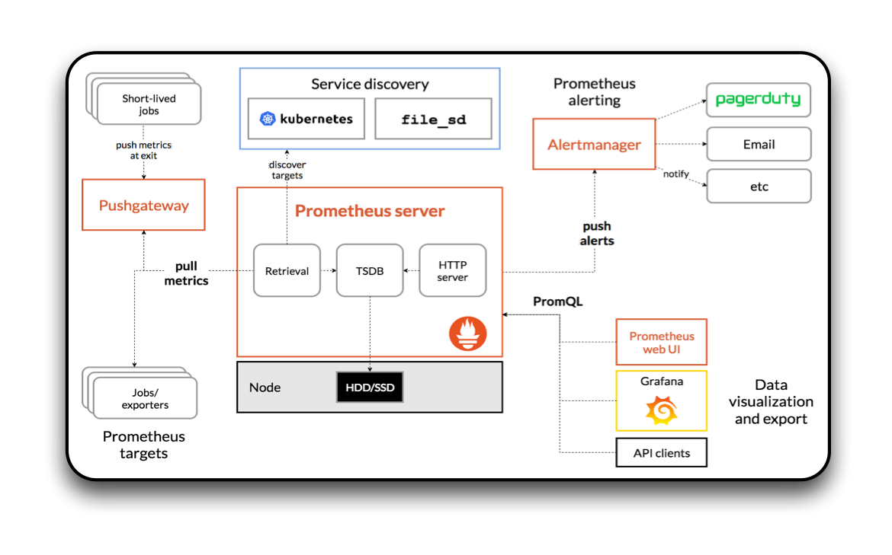

---
# Defenders Security Operations Center

## Overview

This is a (a very early and) high level system design for a digital and virtual security operations center meant to be used by human rights defenders to increase the safety (both physical and digital) of high risk targets in a range of threat landscapes.

