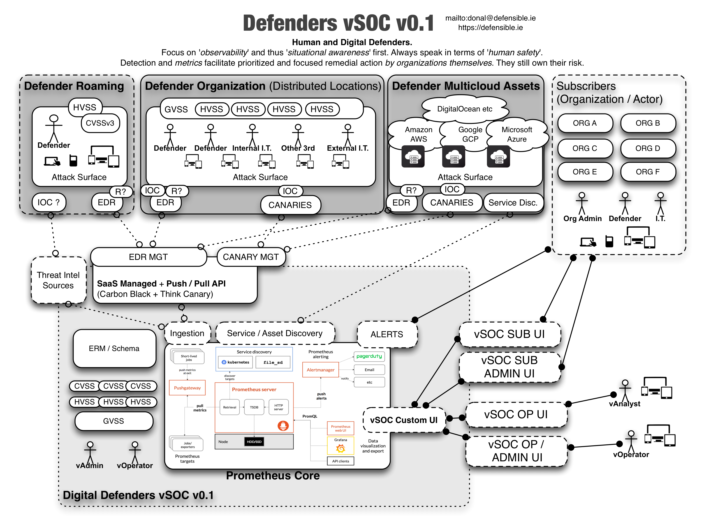

---
# Defenders vSOC

## Introduction

This is a (very early and) high level system design for a digital and virtual security operations center(vSOC) meant to be used by human rights defenders to increase the safety (both physical and digital) of high risk targets in a range of threat landscapes.

## System Overview

A virtual SOC for a defender Co-op with multiple endpoint and network feeds from individuals, NGOs, and non-profits. Redistributed threat intelligence and a customized dashboard per member org. Asset and services enumeration is crucial per organization and a form of cartography and risk mapping is required. A fundamental component is asset management but should be potentially self-populating based upon agents and either passive or active enumeration.

## Problem Statement

Human rights defenders are increasingly at risk via their digital devices and the information they create, store, and maintain. From a transitive trust perspective their sources, and those that they seek to protect, are also at risk by virtue of their own digital security posture. Defenders are often targets of nation states or large well funded organizations who see human rights defenders and journalists as threats to their power base (or even just the status quo).

Human rights defenders also travel to and operate in high risk physical environments. These environments often constitute clear and present danger to their and others safety. Digital tools and networks can both *help* or *hinder* their situation and can affect their level of safety (including that of those around them) by heightening risk or compromising them in a variety of manners (either directly or indirectly).

The complexity and borderless aspects of digital tools and networks mean that defenders are vulnerable to both physical and digital compromise via multiple vectors. Their 'attack surface' is not that of just their tooling, but a wider 'human attack surface' which is informed by differing levels of experience, support, tooling, training, and situational awareness. 

Irrespective of environmental factors or levels of funding, many organizations globally face digital threats they are unable to currently detect, remediate, or even fathom. To increase safety and decrease the risk to human rights defenders, the need was identified to provide a service to multiple groups (such as NGOs, non-profits, and individuals) such that they can leverage a shared security operations center which could inform, alert, and advise them about their current risk and threat levels based upon their specific 'attack surface' and exposure to vulnerabilities. This service would have a multiplier and positive network effect due to an intelligence feedback loop from said organisation and groups who have shared high risk characteristics and operating models. 

Situational awareness (including observability) and detection of compromise are crucial to any to any actor or agent trying to decide their next action based upon their immediate risk profile and theatre of operations.

### Requirements

* To increase the safety of human rights defenders through their use of digital networks and tools
* To convey to donors the increase in human safety and ROSI(Return on Security Investment) via numbers and compelling data driven stories
* TBD

### Considerations

As mentioned one wants to EMPOWER orgs and individuals but they must ENACT changes and are accountable for updates otherwise the SOC will not scale.

### Use Cases (Personas to Follow)

| IT Actor | Ethopia |  London | Russia |
| ----- | ------- |:-------------|:-----|
| Internal FTE | ------- |:-------------|:-----|
| External contractor | ------- |:-------------|:-----|
| None | ------- |:-------------|:-----|

## High Level Principles:
* Assume compromise (nation state, bleeding edge, zero day, physical access)
* Zero Trust architecture/strategy
* Focus on observability, detection, and mean time to "repair"
* Collective crowd intelligence and network effects lead to better and faster positive outcomes
* Rapid deployment of "observability" for endpoints and some networks (and later management/remediation)

### Metrics

HVSS(Human Vulnerability Scoring System) akin to [https://www.first.org/cvss/calculator/3.0](https://www.first.org/cvss/calculator/3.0) but also scraping [https://travel.state.gov/content/travel/en/traveladvisories/traveladvisories.html](https://travel.state.gov/content/travel/en/traveladvisories/traveladvisories.html) and [http://smartraveller.gov.au/countries/pages/list.aspx](http://smartraveller.gov.au/countries/pages/list.aspx) within the context of something similar to http://resiliencemaps.org/

CVSSv3 -> HVSS -> GVSS(Group Vulnerability Scoring System)

### New Top 10s

Rather than top 10 "risks", thinking about top 5 in terms of risk and complexity that relate to human safety (which are the most compelling) but combined with the bottom 5 to enable simple traction and progress with low hanging fruit (to demonstrate movement and improved security posture e.g. feel good factor for the I.T. stakeholder).

### Tactical Prototype

* EDR(Endpoint Detection and Remediation) Carbon Black on endpoints [https://www.carbonblack.com/](https://www.carbonblack.com/) in passive mode  
* Canaries on Networks [https://canary.tools/](https://canary.tools/)  
* vSOC core built on Prometheus [https://prometheus.io/docs/introduction/overview/](https://prometheus.io/docs/introduction/overview/) with Grafana Dash and/or RoR dashboarding.   

## Security Principles

* Least Privilege
* Segregation of Duties
* Defence in Depth
* Accountability
* Availability
* Simplicity
* Reuse
* Minimise Attack Surface
* Compartmentalise
* Fail Securely
* Secure Default
* Do not Trust Services

### Notes on Tech

* [Prometheus (SOC CORE)](https://prometheus.io/docs/introduction/overview/)
* [Carbon Black (Endpoint Detection and Remediation)](https://www.carbonblack.com/)
* [Think Canary (Indicators of Compromise)](https://canary.tools/)
* [First.org (Global CERT)](https://first.org)
* [OODA Loop](https://en.wikipedia.org/wiki/OODA_loop)
