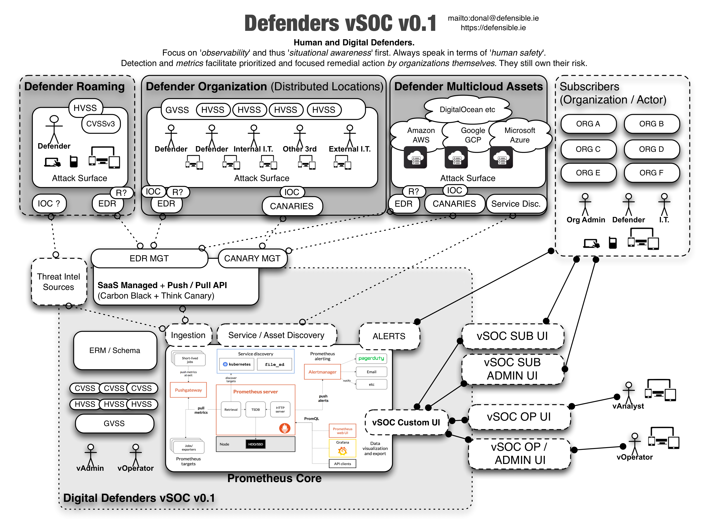

---
# Defenders vSOC

## Overview

This is a (very early and) high level system design for a digital and virtual security operations center(vSOC) meant to be used by human rights defenders to increase the safety (both physical and digital) of high risk targets in a range of threat landscapes.

### Notes on Tech

* [Prometheus](https://prometheus.io/docs/introduction/overview/)
* [Carbon Black](https://www.carbonblack.com/)
* [Think Canary](https://canary.tools/)
